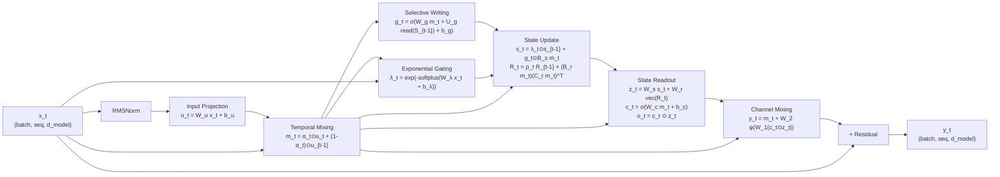
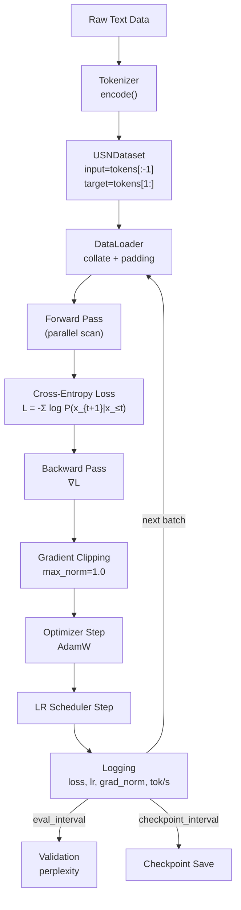
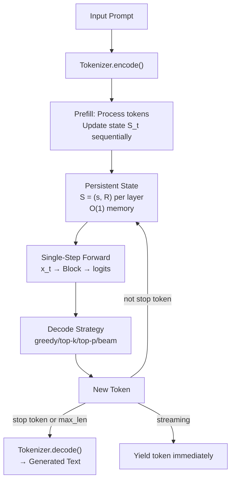
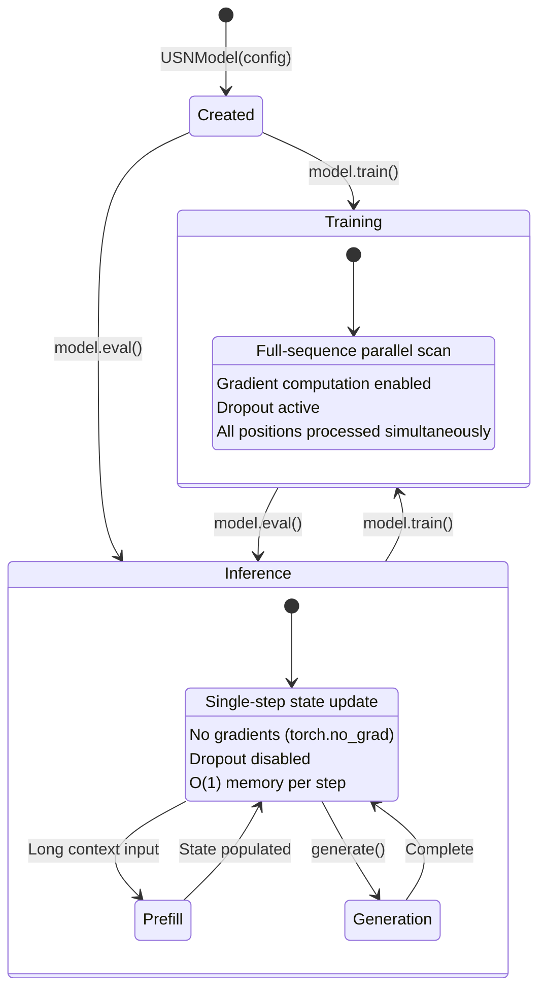

# Design Document: USN Architecture Library

## Overview

The USN (Unified State Network) Architecture Library is a production-grade Python package implementing a novel autoregressive sequence modeling architecture. USN replaces attention mechanisms with a unified persistent state partitioned into semantic (vector) and relational (matrix) subspaces, achieving O(n) training complexity via associative parallel scan and O(1) inference memory via constant-size state.

### Key Design Principles

- **Faithfulness to Paper**: Every equation, architectural choice, and stability mechanism from the original paper is implemented exactly as specified.
- **4-Level Acceleration Hierarchy**: Triton fused kernels → torch.compile → custom autograd → eager PyTorch, with graceful fallback.
- **Pre-Norm Residual Architecture**: Normalization before each block, residual addition after.
- **No Attention, No Positional Encoding**: State encodes position implicitly through recurrence.
- **Single-File Serialization**: The `.usn` format stores everything needed to reconstruct a model.

### Data Flow Summary

The core USN block processes input through 8 sequential stages:
1. **Normalization** (RMSNorm/LayerNorm)
2. **Input Projection** (u_t = W_u x_t + b_u)
3. **Temporal Mixing** (m_t = α_t ⊙ u_t + (1-α_t) ⊙ u_{t-1})
4. **Exponential Gating** (λ_t = exp(-softplus(W_λ x_t + b_λ)))
5. **Selective Writing** (g_t = σ(W_g m_t + U_g read(S_{t-1}) + b_g))
6. **State Update** (s_t = λ_t ⊙ s_{t-1} + g_t ⊙ B_s m_t; R_t = ρ_t R_{t-1} + (B_r m_t)(C_r m_t)^T)
7. **State Readout** (o_t = σ(W_c m_t + b_c) ⊙ [W_s s_t + W_r vec(R_t)])
8. **Channel Mixing** (y_t = m_t + W_2 φ(W_1(c_t ⊙ z_t)))

## Architecture

### System Component Diagram

```mermaid
graph TB
    subgraph "usn/ (Top-Level Package)"
        INIT["__init__.py<br/>Public API exports"]
    end

    subgraph "usn/config/"
        CONFIG["USNConfig<br/>USNTrainingConfig<br/>USNGenerationConfig<br/>Presets"]
    end

    subgraph "usn/core/"
        CORE["BaseModule<br/>TypeDefs<br/>Interfaces<br/>State containers"]
    end

    subgraph "usn/modules/"
        MOD_IP["InputProjection"]
        MOD_TM["TemporalMixing"]
        MOD_EG["ExponentialGating"]
        MOD_SW["SelectiveWriting"]
        MOD_SU["StateUpdate"]
        MOD_SR["StateReadout"]
        MOD_CM["ChannelMixing"]
    end

    subgraph "usn/layers/"
        BLOCK["USNBlock"]
        SCAN["ParallelScan"]
        CHUNK["ChunkDecomposition"]
        NORM["RMSNorm / LayerNorm"]
    end

    subgraph "usn/models/"
        MODEL["USNModel"]
        FACTORY["create_model()"]
    end

    subgraph "usn/training/"
        TRAINER["USNTrainer"]
        DIST["DistributedTraining"]
        CURRICULUM["CurriculumScheduler"]
    end

    subgraph "usn/datasets/"
        DATASET["USNDataset"]
        MATH["MathDataset"]
        COLLATE["collate_fn"]
    end

    subgraph "usn/tokenizers/"
        TOKENIZER["TokenizerInterface"]
        BPE["BPETokenizer"]
        CHAR["CharTokenizer"]
    end

    subgraph "usn/serialization/"
        FORMAT[".usn Format"]
        READER["USNReader"]
        WRITER["USNWriter"]
        VALIDATOR["FormatValidator"]
    end

    subgraph "usn/optim/"
        OPTIM["OptimizerFactory"]
        SCHED["SchedulerFactory"]
        PARAMS["ParameterGroups"]
    end

    subgraph "usn/losses/"
        LOSS["CrossEntropyLoss"]
        PERP["perplexity()"]
    end

    subgraph "usn/backends/"
        DETECT["DeviceDetector"]
        ACCEL["AccelerationManager"]
        TRITON["TritonKernels"]
    end

    subgraph "usn/cli/"
        CLI["CLI Entry Point"]
        TRAIN_CMD["train command"]
        GEN_CMD["generate command"]
        BENCH_CMD["benchmark command"]
    end

    subgraph "usn/utils/"
        UTILS["count_parameters<br/>estimate_memory<br/>set_seed<br/>timer<br/>profiling"]
    end

    CONFIG --> CORE
    CORE --> MOD_IP & MOD_TM & MOD_EG & MOD_SW & MOD_SU & MOD_SR & MOD_CM
    MOD_IP & MOD_TM & MOD_EG & MOD_SW & MOD_SU & MOD_SR & MOD_CM --> BLOCK
    SCAN & CHUNK --> BLOCK
    NORM --> BLOCK
    BLOCK --> MODEL
    MODEL --> TRAINER
    MODEL --> FORMAT
    DATASET --> TRAINER
    TOKENIZER --> DATASET
    OPTIM & SCHED --> TRAINER
    LOSS --> TRAINER
    ACCEL & TRITON --> BLOCK
    DETECT --> ACCEL
    CLI --> MODEL & TRAINER
end
```

### USN Block Data Flow



### Training Pipeline



### Inference Pipeline



### Serialization Architecture (.usn Format)

```mermaid
flowchart TD
    subgraph ".usn File Structure"
        MAGIC["Magic Number: 0x55534E46<br/>(4 bytes)"]
        VER["Format Version<br/>(4 bytes)"]
        HDR["Header<br/>- endianness<br/>- compression flag<br/>- section count<br/>- total size"]
        TOC["Table of Contents<br/>- section offsets<br/>- section sizes<br/>- section types"]
        SEC1["Section: CONFIG<br/>JSON-encoded USNConfig"]
        SEC2["Section: WEIGHTS<br/>Flat tensor data + metadata"]
        SEC3["Section: TOKENIZER<br/>Tokenizer vocabulary + merges"]
        SEC4["Section: OPTIMIZER<br/>Optimizer state tensors"]
        SEC5["Section: METADATA<br/>version, author, date, steps"]
        CHKSUM["SHA-256 Checksum<br/>(32 bytes)"]
    end
    MAGIC --> VER --> HDR --> TOC --> SEC1 --> SEC2 --> SEC3 --> SEC4 --> SEC5 --> CHKSUM
```



### Model State Machine (Training vs Inference)



## Components and Interfaces

### Package: usn/core/

```python
# usn/core/types.py
from typing import NamedTuple, Optional
import torch
from torch import Tensor

class UnifiedState(NamedTuple):
    """Persistent state for a single USN layer."""
    semantic: Tensor   # s_t ∈ R^{batch × d_s}
    relational: Tensor # R_t ∈ R^{batch × k × k}

class ModelState(NamedTuple):
    """Full model state across all layers."""
    layers: tuple[UnifiedState, ...]  # One UnifiedState per layer

class BlockOutput(NamedTuple):
    """Output from a single USN block."""
    hidden: Tensor       # y_t (batch, seq, d_model)
    state: UnifiedState  # Updated state S_t

class GenerationOutput(NamedTuple):
    """Output from autoregressive generation."""
    token_ids: Tensor         # (batch, generated_len)
    log_probs: Optional[Tensor]  # (batch, generated_len) if requested
    final_state: ModelState

class AffineTransition(NamedTuple):
    """Affine map parameters for associative scan."""
    A_semantic: Tensor   # λ_t: (batch, seq, d_s)
    b_semantic: Tensor   # g_t ⊙ B_s m_t: (batch, seq, d_s)
    A_relational: Tensor # ρ_t: (batch, seq, 1) or scalar
    b_relational: Tensor # (B_r m_t)(C_r m_t)^T: (batch, seq, k, k)
```

```python
# usn/core/base.py
import torch.nn as nn
from abc import ABC, abstractmethod

class USNModule(nn.Module, ABC):
    """Base class for all USN submodules with documentation interface."""
    
    @property
    @abstractmethod
    def objective(self) -> str: ...
    
    @property
    @abstractmethod
    def complexity(self) -> str: ...
    
    @property
    @abstractmethod
    def constraints(self) -> list[str]: ...
    
    def reset_parameters(self) -> None:
        """Re-initialize all parameters to their initial values."""
        ...
```

```python
# usn/core/interfaces.py
from abc import ABC, abstractmethod
from torch import Tensor

class TokenizerInterface(ABC):
    """Interface for all tokenizer implementations."""
    
    @abstractmethod
    def encode(self, text: str) -> list[int]: ...
    
    @abstractmethod
    def decode(self, token_ids: list[int]) -> str: ...
    
    @property
    @abstractmethod
    def vocab_size(self) -> int: ...
    
    @property
    @abstractmethod
    def pad_token_id(self) -> int: ...
    
    @property
    @abstractmethod
    def bos_token_id(self) -> int: ...
    
    @property
    @abstractmethod
    def eos_token_id(self) -> int: ...

class LossInterface(ABC):
    """Interface for registrable loss functions."""
    
    @abstractmethod
    def forward(self, logits: Tensor, targets: Tensor, mask: Tensor | None = None) -> Tensor: ...

class SchedulerInterface(ABC):
    """Interface for LR scheduler implementations."""
    
    @abstractmethod
    def get_lr(self, step: int) -> float: ...
    
    @abstractmethod
    def state_dict(self) -> dict: ...
    
    @abstractmethod
    def load_state_dict(self, state: dict) -> None: ...
```

### Package: usn/config/

```python
# usn/config/model_config.py
from dataclasses import dataclass
from typing import Literal

@dataclass(frozen=True)
class USNConfig:
    """Immutable model configuration with full validation."""
    
    # Architecture
    num_layers: int = 12
    d_model: int = 768
    d_s: int = 512          # Semantic state dimension
    k: int = 16             # Relational state dimension (R ∈ R^{k×k})
    d_ff: int = 3072        # Feedforward intermediate dimension
    vocab_size: int = 50257
    max_seq_len: int = 2048
    
    # Normalization and activation
    norm_type: Literal["rmsnorm", "layernorm"] = "rmsnorm"
    norm_eps: float = 1e-6
    activation: Literal["gelu", "silu", "relu"] = "gelu"
    
    # Regularization
    dropout: float = 0.0
    embedding_dropout: float = 0.0
    residual_dropout: float = 0.0
    
    # Architecture options
    tie_weights: bool = True
    scale_embeddings: bool = False
    init_method: Literal["xavier", "normal", "kaiming"] = "xavier"
    
    # Performance
    chunk_size: int = 64
    fused: bool = True
    
    def __post_init__(self) -> None:
        """Validate all parameters on creation."""
        ...
    
    @classmethod
    def tiny(cls) -> "USNConfig": ...      # ~2M params
    @classmethod
    def micro(cls) -> "USNConfig": ...     # ~2M params (validation)
    @classmethod
    def mini(cls) -> "USNConfig": ...      # ~15M params
    @classmethod
    def small(cls) -> "USNConfig": ...     # ~125M params
    @classmethod
    def base(cls) -> "USNConfig": ...      # ~350M params
    @classmethod
    def medium(cls) -> "USNConfig": ...    # ~750M params
    @classmethod
    def large(cls) -> "USNConfig": ...     # ~1.3B params
    @classmethod
    def xl(cls) -> "USNConfig": ...        # ~2.7B params
    @classmethod
    def xxl(cls) -> "USNConfig": ...       # ~6.7B params
    @classmethod
    def from_preset(cls, name: str) -> "USNConfig": ...
    
    def to_json(self) -> str: ...
    def to_yaml(self) -> str: ...
    @classmethod
    def from_json(cls, json_str: str) -> "USNConfig": ...
    @classmethod
    def from_yaml(cls, yaml_str: str) -> "USNConfig": ...
    @classmethod
    def from_dict(cls, d: dict) -> "USNConfig": ...


@dataclass(frozen=True)
class USNTrainingConfig:
    """Training hyperparameters."""
    
    learning_rate: float = 3e-4
    batch_size: int = 32
    max_steps: int = 100_000
    warmup_steps: int = 2000
    weight_decay: float = 0.1
    grad_clip: float = 1.0
    mixed_precision: Literal["none", "fp16", "bf16"] = "bf16"
    gradient_accumulation_steps: int = 1
    
    scheduler_type: Literal["cosine", "linear", "constant", "cosine_restarts"] = "cosine"
    min_lr: float = 1e-5
    
    eval_interval: int = 500
    checkpoint_interval: int = 1000
    max_checkpoints: int = 5
    early_stopping_patience: int = 0  # 0 = disabled
    early_stopping_min_delta: float = 1e-4
    
    distributed_strategy: Literal["none", "ddp", "fsdp"] = "none"
    
    # Curriculum
    sequence_curriculum: bool = False
    curriculum_start_len: int = 128
    curriculum_end_len: int = 2048
    curriculum_warmup_steps: int = 10_000
    
    # Stability
    stability_mode: bool = False
    nan_skip_batch: bool = True
    loss_spike_threshold: float = 5.0
    state_max_norm: float = 1000.0
    
    # Logging
    log_interval: int = 10
    log_format: Literal["console", "json", "tensorboard", "wandb"] = "console"


@dataclass(frozen=True)
class USNGenerationConfig:
    """Generation/inference hyperparameters."""
    
    temperature: float = 1.0
    top_k: int = 0        # 0 = disabled
    top_p: float = 1.0    # 1.0 = disabled
    beam_width: int = 1   # 1 = no beam search
    max_new_tokens: int = 256
    repetition_penalty: float = 1.0
    frequency_penalty: float = 0.0
    presence_penalty: float = 0.0
    no_repeat_ngram_size: int = 0
    length_penalty: float = 1.0
    stop_tokens: list[int] | None = None
    streaming: bool = False
```

### Package: usn/modules/

```python
# usn/modules/input_projection.py
class InputProjection(USNModule):
    """Linear transformation: u_t = W_u x_t + b_u
    
    Complexity: O(d_model²) per timestep
    Constraints: No temporal dependency, operates independently per position
    """
    
    def __init__(self, d_model: int) -> None:
        self.linear = nn.Linear(d_model, d_model)  # W_u, b_u
        # Xavier uniform init for W_u, zeros for b_u
    
    def forward(self, x: Tensor) -> Tensor:
        """(batch, seq, d_model) → (batch, seq, d_model)"""
        return self.linear(x)


# usn/modules/temporal_mixing.py
class TemporalMixing(USNModule):
    """Local temporal blending with learned gate.
    
    α_t = σ(W_α x_t + b_α)
    m_t = α_t ⊙ u_t + (1-α_t) ⊙ u_{t-1}
    
    Complexity: O(d_model) per timestep
    Constraints: Causal (one-step lookback only)
    """
    
    def __init__(self, d_model: int) -> None:
        self.gate_proj = nn.Linear(d_model, d_model)  # W_α, b_α
        self.u_prev_init = nn.Parameter(torch.zeros(d_model))  # Learned u_{-1}
        self._cached_u_prev: Tensor | None = None  # For inference
    
    def forward(
        self, x: Tensor, u: Tensor, u_prev: Tensor | None = None
    ) -> tuple[Tensor, Tensor]:
        """
        Args:
            x: (batch, seq, d_model) - raw input for gate computation
            u: (batch, seq, d_model) - projected input
            u_prev: (batch, 1, d_model) - previous step (inference) or None (training)
        Returns:
            m: (batch, seq, d_model) - temporally mixed representation
            u_last: (batch, 1, d_model) - last u for caching
        """
        ...


# usn/modules/exponential_gating.py
class ExponentialGating(USNModule):
    """Bounded decay factors via exp(-softplus(·)).
    
    λ_t = exp(-softplus(W_λ x_t + b_λ)) ∈ (0, 1)
    ρ_t = exp(-softplus(W_ρ x_t + b_ρ)) ∈ (0, 1)
    
    Complexity: O(d_s + 1) per timestep
    Constraints: Output strictly in (0,1), numerically stable
    """
    
    def __init__(self, d_model: int, d_s: int) -> None:
        self.semantic_proj = nn.Linear(d_model, d_s)   # W_λ, b_λ
        self.relational_proj = nn.Linear(d_model, 1)   # W_ρ, b_ρ
        # Initialize b_λ so initial λ ∈ [0.9, 0.99]
    
    def forward(self, x: Tensor) -> tuple[Tensor, Tensor]:
        """
        Args:
            x: (batch, seq, d_model)
        Returns:
            lambda_t: (batch, seq, d_s) - semantic decay
            rho_t: (batch, seq, 1) - relational decay
        """
        ...


# usn/modules/selective_writing.py
class SelectiveWriting(USNModule):
    """Content-dependent write gate and write content.
    
    g_t = σ(W_g m_t + U_g read(S_{t-1}) + b_g)
    
    Complexity: O(d_s × d_model + d_s × d_read)
    Constraints: g_t bounded in (0,1), uses only past state
    """
    
    def __init__(self, d_model: int, d_s: int, k: int) -> None:
        self.d_read = d_s + k * k
        self.gate_input_proj = nn.Linear(d_model, d_s)    # W_g
        self.gate_state_proj = nn.Linear(self.d_read, d_s) # U_g
        self.gate_bias = nn.Parameter(torch.zeros(d_s))    # b_g
    
    def read_state(self, state: UnifiedState) -> Tensor:
        """Extract read vector from previous state."""
        ...
    
    def forward(
        self, m: Tensor, prev_state: UnifiedState
    ) -> Tensor:
        """
        Returns:
            g_t: (batch, seq, d_s) - write gate values in (0,1)
        """
        ...


# usn/modules/state_update.py
class StateUpdate(USNModule):
    """Unified state transition (affine, associative).
    
    s_t = λ_t ⊙ s_{t-1} + g_t ⊙ (B_s m_t)
    R_t = ρ_t R_{t-1} + (B_r m_t)(C_r m_t)^T
    
    Complexity: O(d_s + k²) per timestep
    Constraints: Bounded state, associative, affine
    """
    
    def __init__(self, d_model: int, d_s: int, k: int) -> None:
        self.B_s = nn.Linear(d_model, d_s, bias=False)   # Semantic write proj
        self.B_r = nn.Linear(d_model, k, bias=False)     # Relational left proj
        self.C_r = nn.Linear(d_model, k, bias=False)     # Relational right proj
    
    def forward_sequential(
        self, m: Tensor, lambda_t: Tensor, rho_t: Tensor,
        g_t: Tensor, prev_state: UnifiedState
    ) -> UnifiedState:
        """Single-step state update (inference)."""
        ...
    
    def forward_parallel(
        self, m: Tensor, lambda_t: Tensor, rho_t: Tensor,
        g_t: Tensor, initial_state: UnifiedState
    ) -> tuple[Tensor, Tensor, UnifiedState]:
        """Full-sequence state update via parallel scan (training).
        Returns all intermediate states for readout."""
        ...


# usn/modules/state_readout.py
class StateReadout(USNModule):
    """Extract and gate information from state.
    
    z_t = W_s s_t + W_r vec(R_t)
    c_t = σ(W_c m_t + b_c)
    o_t = c_t ⊙ z_t
    
    Complexity: O(d_model × d_s + d_model × k²)
    Constraints: c_t bounded in (0,1)
    """
    
    def __init__(self, d_model: int, d_s: int, k: int) -> None:
        self.semantic_proj = nn.Linear(d_s, d_model, bias=False)     # W_s
        self.relational_proj = nn.Linear(k * k, d_model, bias=False) # W_r
        self.confidence_gate = nn.Linear(d_model, d_model)            # W_c, b_c
    
    def forward(
        self, s: Tensor, R: Tensor, m: Tensor
    ) -> tuple[Tensor, Tensor, Tensor]:
        """
        Returns:
            o_t: (batch, seq, d_model) - gated output
            c_t: (batch, seq, d_model) - confidence gate
            z_t: (batch, seq, d_model) - raw state readout
        """
        ...


# usn/modules/channel_mixing.py
class ChannelMixing(USNModule):
    """Feedforward network with residual connection.
    
    y_t = m_t + W_2 φ(W_1(c_t ⊙ z_t))
    
    Complexity: O(d_model × d_ff) per timestep
    Constraints: Residual connection mandatory
    """
    
    def __init__(self, d_model: int, d_ff: int, activation: str = "gelu",
                 dropout: float = 0.0) -> None:
        self.up_proj = nn.Linear(d_model, d_ff)      # W_1
        self.down_proj = nn.Linear(d_ff, d_model)    # W_2
        self.activation = get_activation(activation)  # φ
        self.dropout = nn.Dropout(dropout)
    
    def forward(self, m: Tensor, c: Tensor, z: Tensor) -> Tensor:
        """
        Args:
            m: (batch, seq, d_model) - temporal mix (for residual)
            c: (batch, seq, d_model) - confidence gate
            z: (batch, seq, d_model) - state readout
        Returns:
            y: (batch, seq, d_model) - block output
        """
        ...
```

### Package: usn/layers/

```python
# usn/layers/norm.py
class RMSNorm(nn.Module):
    """Root Mean Square Normalization.
    y = x / RMS(x) × γ where RMS(x) = √(mean(x²) + ε)
    """
    def __init__(self, d_model: int, eps: float = 1e-6) -> None: ...
    def forward(self, x: Tensor) -> Tensor: ...

class LayerNorm(nn.Module):
    """Standard Layer Normalization.
    y = (x - mean(x)) / √(var(x) + ε) × γ + β
    """
    def __init__(self, d_model: int, eps: float = 1e-6) -> None: ...
    def forward(self, x: Tensor) -> Tensor: ...

def create_norm(norm_type: str, d_model: int, eps: float = 1e-6) -> nn.Module:
    """Factory for normalization layers."""
    ...


# usn/layers/block.py
class USNBlock(nn.Module):
    """Complete USN processing block.
    
    Applies submodules in exact order:
    1. Normalization (pre-norm)
    2. Input Projection
    3. Temporal Mixing
    4. Exponential Gating
    5. Selective Writing
    6. State Update
    7. State Readout
    8. Channel Mixing
    
    With block-level residual: output = x + block(norm(x))
    """
    
    def __init__(self, config: USNConfig, layer_idx: int) -> None:
        self.norm = create_norm(config.norm_type, config.d_model, config.norm_eps)
        self.input_proj = InputProjection(config.d_model)
        self.temporal_mix = TemporalMixing(config.d_model)
        self.exp_gate = ExponentialGating(config.d_model, config.d_s)
        self.selective_write = SelectiveWriting(config.d_model, config.d_s, config.k)
        self.state_update = StateUpdate(config.d_model, config.d_s, config.k)
        self.state_readout = StateReadout(config.d_model, config.d_s, config.k)
        self.channel_mix = ChannelMixing(config.d_model, config.d_ff, 
                                          config.activation, config.dropout)
        self.residual_dropout = nn.Dropout(config.residual_dropout)
    
    def forward(
        self, x: Tensor, state: UnifiedState,
        u_prev: Tensor | None = None
    ) -> BlockOutput:
        """
        Args:
            x: (batch, seq, d_model)
            state: Previous layer state
            u_prev: Cached u_{t-1} for inference
        Returns:
            BlockOutput with hidden states and updated state
        """
        ...


# usn/layers/parallel_scan.py
class ParallelScan(torch.autograd.Function):
    """Associative scan for parallel state computation.
    
    Implements prefix-sum over affine transitions:
    (A_2, b_2) ∘ (A_1, b_1) = (A_2 * A_1, A_2 * b_1 + b_2)
    
    For semantic state (element-wise):
    compose((λ_2, v_2), (λ_1, v_1)) = (λ_2 * λ_1, λ_2 * v_1 + v_2)
    
    For relational state (scalar decay):
    compose((ρ_2, M_2), (ρ_1, M_1)) = (ρ_2 * ρ_1, ρ_2 * M_1 + M_2)
    
    Uses log-space for decay accumulation:
    log(Π λ_i) = Σ log(λ_i)
    """
    
    @staticmethod
    def forward(
        ctx,
        log_decay: Tensor,   # log(λ_t): (batch, seq, d_s)
        values: Tensor,       # g_t ⊙ B_s m_t: (batch, seq, d_s)
        initial_state: Tensor # s_0: (batch, d_s)
    ) -> Tensor:
        """Returns all states s_1, ..., s_n: (batch, seq, d_s)"""
        ...
    
    @staticmethod
    def backward(ctx, grad_output: Tensor) -> tuple[Tensor, ...]:
        """Custom backward for memory efficiency."""
        ...


class ChunkedParallelScan(nn.Module):
    """Chunk-based decomposition for memory-efficient parallel scan.
    
    1. Divide sequence into chunks of size C
    2. Apply parallel scan within each chunk
    3. Propagate inter-chunk state sequentially
    
    Memory: O(C × d_state + n/C × d_state) vs O(n × d_state)
    """
    
    def __init__(self, chunk_size: int = 64) -> None: ...
    
    def forward(
        self, log_decay: Tensor, values: Tensor,
        initial_state: Tensor
    ) -> Tensor:
        """
        Args:
            log_decay: (batch, seq, d_s) - log of decay factors
            values: (batch, seq, d_s) - additive terms
            initial_state: (batch, d_s) - initial state
        Returns:
            states: (batch, seq, d_s) - all intermediate states
        """
        ...
```

### Parallel Scan Algorithm (Pseudocode)

```
# Semantic State Parallel Scan (Log-Space)
# Input: log_λ[1..n], v[1..n], s_0
# Output: s[1..n] where s_t = λ_t * s_{t-1} + v_t

function parallel_scan_semantic(log_λ, v, s_0):
    n = len(log_λ)
    
    # Phase 1: Compute cumulative log-decays
    cum_log_λ = prefix_sum(log_λ)  # cum_log_λ[t] = Σ_{i=1}^{t} log_λ[i]
    
    # Phase 2: Transform values to account for decay
    # scaled_v[t] = v[t] * exp(-cum_log_λ[t] + cum_log_λ[t])
    # Actually use associative scan on (λ_t, v_t) tuples:
    
    # Associative composition:
    # (a2, b2) ∘ (a1, b1) = (a2 * a1, a2 * b1 + b2)
    # In log-space for a: (log_a2, b2) ∘ (log_a1, b1) = (log_a2 + log_a1, exp(log_a2) * b1 + b2)
    
    pairs = [(log_λ[t], v[t]) for t in 1..n]
    scanned = associative_scan(compose, pairs)
    
    # Phase 3: Incorporate initial state
    # s_t = exp(cum_log_λ[t]) * s_0 + scanned_b[t]
    for t in 1..n:
        s[t] = exp(scanned[t].log_a) * s_0 + scanned[t].b
    
    return s

# Relational State Parallel Scan
# Input: ρ[1..n], M[1..n] (outer products), R_0
# Output: R[1..n] where R_t = ρ_t * R_{t-1} + M_t

function parallel_scan_relational(ρ, M, R_0):
    # Same structure but with scalar decay and matrix additive term
    # (ρ_2, M_2) ∘ (ρ_1, M_1) = (ρ_2 * ρ_1, ρ_2 * M_1 + M_2)
    pairs = [(log(ρ[t]), M[t]) for t in 1..n]
    scanned = associative_scan(compose_relational, pairs)
    
    for t in 1..n:
        R[t] = exp(scanned[t].log_ρ) * R_0 + scanned[t].M
    
    return R

# Chunk Decomposition
function chunked_scan(log_λ, v, s_0, chunk_size=64):
    chunks = split(log_λ, v, chunk_size)
    state = s_0
    all_states = []
    
    for chunk in chunks:
        # Parallel scan within chunk (fast, GPU-parallel)
        chunk_states = parallel_scan_semantic(chunk.log_λ, chunk.v, state)
        all_states.append(chunk_states)
        # Sequential propagation: last state of chunk → next chunk initial
        state = chunk_states[-1]
    
    return concatenate(all_states)
```

### Package: usn/models/

```python
# usn/models/usn_model.py
class USNModel(nn.Module):
    """Complete USN model: Embedding → N × Block → Norm → Output Head.
    
    Achieves O(n) training complexity via parallel scan.
    Achieves O(1) inference memory via constant-size state.
    Contains NO attention mechanism or quadratic operations.
    """
    
    def __init__(self, config: USNConfig) -> None:
        self.config = config
        self.embedding = TokenEmbedding(config.vocab_size, config.d_model,
                                         scale=config.scale_embeddings,
                                         dropout=config.embedding_dropout)
        self.blocks = nn.ModuleList([
            USNBlock(config, layer_idx=i) for i in range(config.num_layers)
        ])
        self.final_norm = create_norm(config.norm_type, config.d_model, config.norm_eps)
        self.output_head = OutputHead(config.d_model, config.vocab_size, 
                                      bias=False)
        
        if config.tie_weights:
            self.output_head.weight = self.embedding.weight
        
        self._init_weights()
    
    def forward(
        self, input_ids: Tensor,
        initial_state: ModelState | None = None,
        padding_mask: Tensor | None = None
    ) -> tuple[Tensor, ModelState]:
        """
        Args:
            input_ids: (batch, seq) - token IDs
            initial_state: Optional initial state for all layers
            padding_mask: (batch, seq) - True for valid positions
        Returns:
            logits: (batch, seq, vocab_size)
            final_state: Updated state for all layers
        """
        ...
    
    def generate(
        self, input_ids: Tensor,
        gen_config: USNGenerationConfig | None = None,
        initial_state: ModelState | None = None,
        **kwargs
    ) -> GenerationOutput:
        """High-level generation method."""
        ...
    
    def get_state(self) -> ModelState: ...
    def set_state(self, state: ModelState) -> None: ...
    def reset_state(self) -> None: ...
    
    def enable_gradient_checkpointing(self, level: str = "per_block") -> None: ...
    def summary(self) -> str: ...
    
    @property
    def num_parameters(self) -> int: ...
    @property
    def state_size_per_layer(self) -> int:
        """d_s + k² floats per layer."""
        ...
    @property
    def total_state_size(self) -> int:
        """num_layers × (d_s + k²) floats."""
        ...


# usn/models/embedding.py
class TokenEmbedding(nn.Module):
    """Learned token embeddings with optional scaling and dropout."""
    
    def __init__(self, vocab_size: int, d_model: int,
                 scale: bool = False, dropout: float = 0.0) -> None:
        self.embedding = nn.Embedding(vocab_size, d_model)
        self.scale_factor = d_model ** 0.5 if scale else 1.0
        self.dropout = nn.Dropout(dropout)
    
    @property
    def weight(self) -> Tensor:
        return self.embedding.weight
    
    def forward(self, token_ids: Tensor) -> Tensor:
        """(batch, seq) → (batch, seq, d_model)"""
        ...


class OutputHead(nn.Module):
    """Linear projection to vocabulary logits (no softmax)."""
    
    def __init__(self, d_model: int, vocab_size: int, bias: bool = False) -> None:
        self.linear = nn.Linear(d_model, vocab_size, bias=bias)
    
    @property
    def weight(self) -> nn.Parameter:
        return self.linear.weight
    
    @weight.setter
    def weight(self, value: nn.Parameter) -> None:
        self.linear.weight = value
    
    def forward(self, hidden: Tensor) -> Tensor:
        """(batch, seq, d_model) → (batch, seq, vocab_size)"""
        return self.linear(hidden)
```

### Package: usn/training/

```python
# usn/training/trainer.py
class USNTrainer:
    """Full training loop with all standard features.
    
    Supports: mixed precision, gradient accumulation, distributed training,
    curriculum learning, early stopping, checkpointing, logging.
    """
    
    def __init__(
        self,
        model: USNModel,
        train_dataset: Dataset,
        training_config: USNTrainingConfig,
        val_dataset: Dataset | None = None,
        tokenizer: TokenizerInterface | None = None,
        optimizer: Optimizer | None = None,
        scheduler: SchedulerInterface | None = None,
    ) -> None: ...
    
    def train(self) -> dict[str, float]:
        """Execute full training loop. Returns final metrics."""
        ...
    
    def train_step(self, batch: dict[str, Tensor]) -> float:
        """Single training step: forward → loss → backward → step."""
        ...
    
    def evaluate(self) -> dict[str, float]:
        """Run validation, return metrics (loss, perplexity)."""
        ...
    
    def save_checkpoint(self, path: str) -> None: ...
    def load_checkpoint(self, path: str) -> None: ...
    def resume(self, checkpoint_path: str) -> None: ...
    
    def diagnose(self) -> dict[str, Any]:
        """Run all training diagnostics."""
        ...


# usn/training/distributed.py
class DistributedTrainer:
    """Wrapper for DDP/FSDP distributed training."""
    
    @staticmethod
    def setup(strategy: str, model: USNModel) -> nn.Module: ...
    
    @staticmethod
    def cleanup() -> None: ...
    
    @staticmethod
    def is_main_process() -> bool: ...


# usn/training/curriculum.py
class CurriculumScheduler:
    """Sequence length curriculum: short → long over training."""
    
    def __init__(self, start_len: int, end_len: int, 
                 warmup_steps: int, schedule: str = "linear") -> None: ...
    
    def get_seq_len(self, step: int) -> int: ...
    def state_dict(self) -> dict: ...
    def load_state_dict(self, state: dict) -> None: ...
```

### Package: usn/serialization/

```python
# usn/serialization/format_spec.py
"""
.usn Binary Format Specification v1

Layout:
┌─────────────────────────────────┐
│ Magic Number (4 bytes): 0x55534E46 ("USNF")
│ Format Version (4 bytes): uint32
├─────────────────────────────────┤
│ Header (variable):
│   - endianness: uint8 (0=little, 1=big)
│   - compression: uint8 (0=none, 1=zlib, 2=lz4)
│   - section_count: uint32
│   - total_file_size: uint64
├─────────────────────────────────┤
│ Table of Contents (section_count × entry):
│   - section_type: uint16
│   - offset: uint64
│   - size: uint64
│   - compressed_size: uint64 (0 if uncompressed)
├─────────────────────────────────┤
│ Section: CONFIG (type=0x01)
│   JSON-encoded USNConfig
├─────────────────────────────────┤
│ Section: WEIGHTS (type=0x02)
│   Tensor manifest: [{name, dtype, shape, offset}]
│   Raw tensor data (contiguous, platform-independent)
├─────────────────────────────────┤
│ Section: TOKENIZER (type=0x03) [optional]
│   Tokenizer type + vocabulary + merges
├─────────────────────────────────┤
│ Section: OPTIMIZER (type=0x04) [optional]
│   Optimizer state tensors
├─────────────────────────────────┤
│ Section: METADATA (type=0x05)
│   JSON: {version, author, date, steps, description}
├─────────────────────────────────┤
│ SHA-256 Checksum (32 bytes)
└─────────────────────────────────┘
"""

MAGIC_NUMBER = 0x55534E46  # "USNF"
FORMAT_VERSION = 1

class SectionType(IntEnum):
    CONFIG = 0x01
    WEIGHTS = 0x02
    TOKENIZER = 0x03
    OPTIMIZER = 0x04
    METADATA = 0x05
    SCHEDULER = 0x06
    TRAINING_STATE = 0x07


# usn/serialization/writer.py
class USNWriter:
    """Writes models to .usn format."""
    
    def save(
        self,
        path: str,
        model: USNModel,
        include_optimizer: bool = True,
        include_tokenizer: bool = True,
        compression: str = "none",
        metadata: dict[str, str] | None = None
    ) -> None: ...
    
    def _write_header(self, f: BinaryIO, sections: list) -> None: ...
    def _write_config(self, f: BinaryIO, config: USNConfig) -> bytes: ...
    def _write_weights(self, f: BinaryIO, model: USNModel) -> bytes: ...
    def _compute_checksum(self, data: bytes) -> bytes: ...


# usn/serialization/reader.py  
class USNReader:
    """Reads models from .usn format with integrity verification."""
    
    def load(
        self, path: str, 
        map_location: str | torch.device | None = None,
        sections: list[SectionType] | None = None  # Partial loading
    ) -> dict:
        """Load .usn file, verify checksum, return components."""
        ...
    
    def load_config_only(self, path: str) -> USNConfig: ...
    def load_metadata_only(self, path: str) -> dict: ...
    def validate(self, path: str) -> bool: ...


# usn/serialization/validator.py
class FormatValidator:
    """Validates .usn file integrity and compatibility."""
    
    def verify_checksum(self, path: str) -> bool: ...
    def verify_format_version(self, path: str) -> int: ...
    def verify_weights_match_config(self, weights: dict, config: USNConfig) -> bool: ...


# usn/serialization/migration.py
class FormatMigrator:
    """Handles migration between format versions."""
    
    _migrations: dict[tuple[int, int], Callable] = {}
    
    def migrate(self, data: dict, from_version: int, to_version: int) -> dict: ...
    def register_migration(self, from_v: int, to_v: int, fn: Callable) -> None: ...
```

### Package: usn/backends/

```python
# usn/backends/detection.py
class DeviceDetector:
    """Auto-detect available hardware and capabilities."""
    
    @staticmethod
    def detect() -> dict[str, Any]:
        """Returns: {device, cuda_available, mps_available, 
                     gpu_name, gpu_memory, compute_capability}"""
        ...
    
    @staticmethod
    def best_device() -> torch.device: ...

# usn/backends/acceleration.py
class AccelerationLevel(IntEnum):
    TRITON = 1       # Custom Triton fused kernels
    COMPILE = 2      # torch.compile with inductor
    AUTOGRAD = 3     # Custom autograd functions
    EAGER = 4        # Standard PyTorch eager

class AccelerationManager:
    """Manages 4-level acceleration hierarchy with graceful fallback."""
    
    _current_level: AccelerationLevel = AccelerationLevel.EAGER
    
    @classmethod
    def detect_best_level(cls) -> AccelerationLevel: ...
    
    @classmethod
    def set_level(cls, level: int | AccelerationLevel) -> None: ...
    
    @classmethod
    def get_level(cls) -> AccelerationLevel: ...
    
    @classmethod
    def get_kernel(cls, kernel_name: str) -> Callable:
        """Get the appropriate kernel implementation for current level."""
        ...


# usn/backends/triton_kernels.py (Level 1)
class TritonKernels:
    """Triton JIT-compiled fused kernels."""
    
    @staticmethod
    def fused_projections(x: Tensor, W_gate: Tensor, b_gate: Tensor) -> tuple[Tensor, Tensor, Tensor]:
        """Fused W_u, W_α, W_λ projection (Req 101)."""
        ...
    
    @staticmethod
    def fused_temporal_gate(u: Tensor, alpha_pre: Tensor, lambda_pre: Tensor,
                            u_prev: Tensor) -> tuple[Tensor, Tensor]:
        """Fused sigmoid + interpolation + exp(-softplus) (Req 102)."""
        ...
    
    @staticmethod
    def fused_state_core(
        m: Tensor, lambda_t: Tensor, rho_t: Tensor, g_t: Tensor,
        s_init: Tensor, R_init: Tensor,
        B_s: Tensor, B_r: Tensor, C_r: Tensor,
        W_s: Tensor, W_r: Tensor, W_c: Tensor, b_c: Tensor,
        chunk_size: int
    ) -> tuple[Tensor, Tensor, Tensor]:
        """Heart of USN kernel: state update + readout in SRAM (Req 103)."""
        ...
    
    @staticmethod
    def fused_channel_mlp(x: Tensor, W_1: Tensor, W_2: Tensor,
                          activation: str) -> Tensor:
        """Fused MLP: W_1 → φ → W_2 in tiles (Req 104)."""
        ...
```

### Package: usn/optim/

```python
# usn/optim/factory.py
class OptimizerFactory:
    """Creates optimizers with correct parameter group separation."""
    
    @staticmethod
    def create(
        model: USNModel,
        config: USNTrainingConfig
    ) -> torch.optim.Optimizer:
        """Create AdamW with proper weight decay separation."""
        ...
    
    @staticmethod
    def get_parameter_groups(
        model: USNModel, weight_decay: float
    ) -> list[dict]:
        """Separate: decay (weights) vs no-decay (biases, norms)."""
        ...

# usn/optim/schedulers.py
class CosineAnnealingScheduler(SchedulerInterface):
    def __init__(self, max_lr: float, min_lr: float, total_steps: int) -> None: ...
    def get_lr(self, step: int) -> float: ...

class LinearWarmupScheduler(SchedulerInterface):
    def __init__(self, max_lr: float, warmup_steps: int) -> None: ...
    def get_lr(self, step: int) -> float: ...

class WarmupCosineScheduler(SchedulerInterface):
    """Combined linear warmup + cosine decay (default)."""
    def __init__(self, max_lr: float, min_lr: float, 
                 warmup_steps: int, total_steps: int) -> None: ...
    def get_lr(self, step: int) -> float: ...

class CosineWarmRestartsScheduler(SchedulerInterface):
    def __init__(self, max_lr: float, min_lr: float,
                 restart_period: int) -> None: ...
    def get_lr(self, step: int) -> float: ...

def create_scheduler(config: USNTrainingConfig) -> SchedulerInterface:
    """Factory based on config.scheduler_type."""
    ...
```

### Package: usn/losses/

```python
# usn/losses/cross_entropy.py
class USNCrossEntropyLoss(nn.Module):
    """Numerically stable cross-entropy for next-token prediction.
    
    Uses log_softmax formulation (not softmax + log separately).
    Supports label smoothing and padding mask.
    """
    
    def __init__(self, label_smoothing: float = 0.0, 
                 ignore_index: int = -100) -> None: ...
    
    def forward(
        self, logits: Tensor, targets: Tensor, 
        mask: Tensor | None = None
    ) -> Tensor:
        """
        Args:
            logits: (batch, seq, vocab_size) - raw logits
            targets: (batch, seq) - target token IDs
            mask: (batch, seq) - True for valid positions
        Returns:
            loss: scalar - mean cross-entropy over valid tokens
        """
        ...

def compute_perplexity(loss: Tensor) -> Tensor:
    """perplexity = exp(loss)"""
    return torch.exp(loss)
```

### Package: usn/datasets/

```python
# usn/datasets/usn_dataset.py
class USNDataset(torch.utils.data.Dataset):
    """Causal language modeling dataset.
    
    Creates (input, target) pairs: input=tokens[:-1], target=tokens[1:]
    """
    
    def __init__(
        self,
        data_source: str | list[str] | Iterable,
        tokenizer: TokenizerInterface,
        max_seq_len: int,
        source_type: str = "text"  # "text", "json", "jsonl", "csv", "huggingface"
    ) -> None: ...
    
    def __len__(self) -> int: ...
    def __getitem__(self, idx: int) -> dict[str, Tensor]: ...

class StreamingUSNDataset(torch.utils.data.IterableDataset):
    """Streaming dataset for large corpora."""
    
    def __init__(self, data_source: Iterable, tokenizer: TokenizerInterface,
                 max_seq_len: int, shuffle_buffer: int = 10000) -> None: ...
    def __iter__(self) -> Iterator[dict[str, Tensor]]: ...

def usn_collate_fn(
    batch: list[dict[str, Tensor]], 
    pad_token_id: int
) -> dict[str, Tensor]:
    """Pad sequences and create masks."""
    ...

# usn/datasets/math_dataset.py
class MathDataset(torch.utils.data.Dataset):
    """Synthetic arithmetic dataset for validation.
    
    Generates: "5+3=8", "12*7=84", "100-42=58"
    """
    
    def __init__(
        self, num_samples: int = 10000, 
        max_digits: int = 3,
        operations: list[str] = ["+", "-", "*"],
        split: str = "train"  # train/val/test
    ) -> None: ...
    
    def __len__(self) -> int: ...
    def __getitem__(self, idx: int) -> dict[str, Tensor]: ...
    
    @property
    def tokenizer(self) -> CharTokenizer: ...
```

### Package: usn/tokenizers/

```python
# usn/tokenizers/interface.py (defined in core/interfaces.py, implementations here)

# usn/tokenizers/bpe_tokenizer.py
class BPETokenizer(TokenizerInterface):
    """BPE tokenizer via HuggingFace tokenizers library."""
    
    def __init__(self, tokenizer_path: str | None = None) -> None: ...
    def encode(self, text: str) -> list[int]: ...
    def decode(self, token_ids: list[int]) -> str: ...
    def batch_encode(self, texts: list[str]) -> list[list[int]]: ...
    def batch_decode(self, batch_ids: list[list[int]]) -> list[str]: ...
    def save(self, path: str) -> None: ...
    @classmethod
    def load(cls, path: str) -> "BPETokenizer": ...
    @classmethod
    def from_pretrained(cls, name: str) -> "BPETokenizer": ...
    @classmethod
    def train(cls, corpus: list[str], vocab_size: int) -> "BPETokenizer": ...

# usn/tokenizers/char_tokenizer.py
class CharTokenizer(TokenizerInterface):
    """Character-level tokenizer for simple experiments."""
    
    def __init__(self, chars: str = "") -> None: ...
    def encode(self, text: str) -> list[int]: ...
    def decode(self, token_ids: list[int]) -> str: ...

# usn/tokenizers/word_tokenizer.py
class WordTokenizer(TokenizerInterface):
    """Word-level tokenizer with configurable vocabulary."""
    ...
```

### Package: usn/cli/

```python
# usn/cli/main.py
"""
CLI entry point accessible via `usn` command.

Commands:
  usn train --config <path>                      Train a model
  usn generate --model <path> --prompt <text>    Generate text
  usn benchmark --model <path>                   Run benchmarks
  usn info --model <path>                        Display model info
  usn export --model <path> --format <fmt>       Export model
  usn validate --model <path>                    Validate .usn file
"""

import click

@click.group()
def cli(): ...

@cli.command()
@click.option("--config", required=True, help="Training config YAML path")
@click.option("--verbose/--quiet", default=True)
def train(config: str, verbose: bool) -> None: ...

@cli.command()
@click.option("--model", required=True, help="Path to .usn model file")
@click.option("--prompt", required=True, help="Generation prompt")
@click.option("--max-tokens", default=256)
@click.option("--temperature", default=1.0)
@click.option("--top-k", default=0)
@click.option("--top-p", default=1.0)
def generate(model: str, prompt: str, **kwargs) -> None: ...

@cli.command()
@click.option("--model", required=True)
@click.option("--all", is_flag=True, help="Run full benchmark suite")
def benchmark(model: str, all: bool) -> None: ...

@cli.command()
@click.option("--model", required=True)
def info(model: str) -> None: ...

@cli.command()
@click.option("--model", required=True)
@click.option("--format", type=click.Choice(["onnx", "safetensors", "state_dict", "torchscript"]))
@click.option("--output", required=True)
def export(model: str, format: str, output: str) -> None: ...

@cli.command()
@click.option("--model", required=True)
def validate(model: str) -> None: ...
```

### Package: usn/utils/

```python
# usn/utils/counting.py
def count_parameters(model: nn.Module) -> dict[str, int]:
    """Returns {total, trainable, non_trainable}."""
    ...

def estimate_memory(config: USNConfig, 
                    mode: str = "training") -> dict[str, float]:
    """Estimate memory in MB for training or inference."""
    ...

def estimate_flops(config: USNConfig, seq_len: int) -> int:
    """Estimate FLOPs per forward pass."""
    ...

# usn/utils/seed.py
def set_seed(seed: int) -> None:
    """Set all random seeds for reproducibility."""
    import random, numpy as np
    random.seed(seed)
    np.random.seed(seed)
    torch.manual_seed(seed)
    if torch.cuda.is_available():
        torch.cuda.manual_seed_all(seed)

# usn/utils/timing.py
@contextmanager
def timer(name: str = "") -> Generator[None, None, None]:
    """Context manager for timing code sections."""
    ...

@contextmanager
def memory_tracker() -> Generator[dict, None, None]:
    """Context manager for measuring peak memory."""
    ...

# usn/utils/profiling.py
def profile_forward(model: USNModel, input_ids: Tensor) -> dict[str, float]: ...
def profile_backward(model: USNModel, input_ids: Tensor) -> dict[str, float]: ...
def profile_memory(model: USNModel, input_ids: Tensor) -> dict[str, float]: ...

# usn/utils/visualization.py
def visualize_state(state: UnifiedState) -> None:
    """Plot semantic state norms and relational state heatmap."""
    ...

def visualize_gates(activations: dict[str, Tensor]) -> None:
    """Plot gate values (α, λ, g, c, ρ) over positions."""
    ...

# usn/utils/diagnostics.py
def gradient_stats(model: nn.Module) -> dict[str, dict[str, float]]:
    """Per-parameter gradient: norm, mean, max, min, frac_zero."""
    ...

def activation_stats(model: nn.Module) -> dict[str, dict[str, float]]:
    """Hook-based activation monitoring."""
    ...

def check_state_health(model: USNModel) -> dict[str, Any]:
    """Diagnose state norms, decay stats, potential issues."""
    ...
```

### Package: usn/exceptions.py

```python
class USNError(Exception):
    """Base exception for all USN library errors."""
    pass

class ConfigError(USNError):
    """Invalid configuration parameters."""
    pass

class ShapeError(USNError):
    """Tensor shape mismatch."""
    pass

class IntegrityError(USNError):
    """File integrity check failed (checksum mismatch)."""
    pass

class VersionError(USNError):
    """Incompatible format version."""
    pass

class TrainingError(USNError):
    """Error during training (NaN, divergence, etc.)."""
    pass

class GenerationError(USNError):
    """Error during text generation."""
    pass
```

### Top-Level Public API (usn/__init__.py)

```python
"""USN - Unified State Network Architecture Library."""

__version__ = "0.1.0"
__author__ = "BUEORM"

# Core classes
from usn.models.usn_model import USNModel
from usn.config.model_config import USNConfig, USNTrainingConfig, USNGenerationConfig
from usn.training.trainer import USNTrainer
from usn.inference.generator import USNGenerator

# Factory functions
def create_model(config: USNConfig | str | None = None, 
                 device: str = "auto", **kwargs) -> USNModel: ...
def train(model: USNModel, dataset, config: USNTrainingConfig | None = None, **kwargs) -> dict: ...
def generate(model: USNModel, prompt: str, max_tokens: int = 256, **kwargs) -> str: ...
def save(model: USNModel, path: str, include_optimizer: bool = True,
         include_tokenizer: bool = True, metadata: dict | None = None) -> None: ...
def load(path: str, map_location: str | None = None) -> USNModel: ...
def export(model: USNModel, format: str, path: str, **kwargs) -> None: ...
def from_pretrained(path_or_id: str) -> USNModel: ...
def summary(model: USNModel) -> str: ...
def benchmark(model: USNModel, config: dict | None = None) -> dict: ...
def set_seed(seed: int) -> None: ...
def device_info() -> dict: ...
def set_acceleration_level(level: int) -> None: ...
def benchmark_acceleration() -> dict: ...
```

### USN Generator (usn/inference/generator.py)

```python
class USNGenerator:
    """Autoregressive text generation with multiple decoding strategies.
    
    Operates with O(1) memory w.r.t. generated length (state-based).
    """
    
    def __init__(
        self, model: USNModel, tokenizer: TokenizerInterface,
        config: USNGenerationConfig | None = None
    ) -> None: ...
    
    def generate(
        self, prompt: str | list[str],
        max_new_tokens: int | None = None,
        **kwargs
    ) -> GenerationOutput:
        """Generate from prompt(s). Supports batch generation."""
        ...
    
    def stream(
        self, prompt: str, max_new_tokens: int | None = None, **kwargs
    ) -> Iterator[tuple[str, int, float]]:
        """Streaming generation yielding (token_text, token_id, log_prob)."""
        ...
    
    async def astream(
        self, prompt: str, max_new_tokens: int | None = None, **kwargs
    ) -> AsyncIterator[tuple[str, int, float]]:
        """Async streaming for web frameworks."""
        ...
    
    def _greedy_decode(self, logits: Tensor) -> Tensor: ...
    def _sample_with_temperature(self, logits: Tensor, temp: float) -> Tensor: ...
    def _top_k_filter(self, logits: Tensor, k: int) -> Tensor: ...
    def _top_p_filter(self, logits: Tensor, p: float) -> Tensor: ...
    def _apply_repetition_penalty(self, logits: Tensor, 
                                    generated: list[int]) -> Tensor: ...
    def _beam_search(self, initial_state: ModelState, 
                      prompt_ids: Tensor) -> list[GenerationOutput]: ...
```

## Data Models

### State Data Structures

```python
# Core mathematical objects and their representations

# Semantic State: s_t ∈ R^{d_s}
# - Stored as: Tensor of shape (batch_size, d_s)
# - Properties: bounded by construction (λ < 1 ensures exponential decay)
# - Memory: batch_size × d_s × sizeof(dtype) per layer

# Relational State: R_t ∈ R^{k×k}
# - Stored as: Tensor of shape (batch_size, k, k)
# - Properties: rank-1 updates via outer product, bounded by ρ < 1
# - Memory: batch_size × k² × sizeof(dtype) per layer
# - Vectorized form: vec(R_t) ∈ R^{k²} for readout projection

# Unified State: S_t = (s_t, R_t)
# - Total per-layer memory: batch × (d_s + k²) × sizeof(dtype)
# - Total model memory: batch × num_layers × (d_s + k²) × sizeof(dtype)
```

### Affine Transition Representation

```python
# For parallel scan, state transitions are represented as affine maps:
# T_t(S) = A_t × S + b_t

# Semantic transitions (element-wise):
#   A_t = diag(λ_t)  →  stored as vector λ_t ∈ R^{d_s}
#   b_t = g_t ⊙ B_s m_t  →  stored as vector ∈ R^{d_s}

# Relational transitions (scalar decay):
#   A_t = ρ_t × I  →  stored as scalar ρ_t ∈ R
#   b_t = (B_r m_t)(C_r m_t)^T  →  stored as matrix ∈ R^{k×k}

# Composition rule (associative):
#   (A_2, b_2) ∘ (A_1, b_1) = (A_2 × A_1, A_2 × b_1 + b_2)
#
#   Semantic: (λ_2, v_2) ∘ (λ_1, v_1) = (λ_2 ⊙ λ_1, λ_2 ⊙ v_1 + v_2)
#   Relational: (ρ_2, M_2) ∘ (ρ_1, M_1) = (ρ_2 × ρ_1, ρ_2 × M_1 + M_2)
```

### Configuration Data Model

| Parameter | Type | Default | Constraint |
|-----------|------|---------|------------|
| num_layers | int | 12 | ≥ 1 |
| d_model | int | 768 | ≥ 4, power of 2 preferred |
| d_s | int | 512 | 1 ≤ d_s ≤ d_model |
| k | int | 16 | ≥ 1, k² ≤ 10 × d_model (warning) |
| d_ff | int | 3072 | ≥ d_model |
| vocab_size | int | 50257 | ≥ 2 |
| max_seq_len | int | 2048 | ≥ 1 |
| chunk_size | int | 64 | ≥ 1, power of 2 preferred |

### Scalability Table (Preset Configurations)

| Name | Layers | d_model | d_s | k | d_ff | Params | State/Layer | Total State |
|------|--------|---------|-----|---|------|--------|-------------|-------------|
| Tiny | 4 | 128 | 64 | 8 | 512 | ~2M | 128 | 512 |
| Micro | 6 | 192 | 128 | 8 | 768 | ~5M | 192 | 1,152 |
| Mini | 8 | 384 | 256 | 12 | 1536 | ~15M | 400 | 3,200 |
| Small | 12 | 768 | 512 | 16 | 3072 | ~125M | 768 | 9,216 |
| Base | 24 | 1024 | 768 | 24 | 4096 | ~350M | 1,344 | 32,256 |
| Medium | 32 | 1280 | 1024 | 32 | 5120 | ~750M | 2,048 | 65,536 |
| Large | 36 | 1536 | 1024 | 32 | 6144 | ~1.3B | 2,048 | 73,728 |
| XL | 48 | 2048 | 1536 | 48 | 8192 | ~2.7B | 3,840 | 184,320 |
| XXL | 64 | 2560 | 2048 | 48 | 10240 | ~6.7B | 4,352 | 278,528 |
| 13B | 80 | 3200 | 2560 | 64 | 12800 | ~13B | 6,656 | 532,480 |
| 30B | 96 | 4096 | 3072 | 64 | 16384 | ~30B | 7,168 | 688,128 |
| 65B | 128 | 5120 | 4096 | 80 | 20480 | ~65B | 10,496 | 1,343,488 |

*State/Layer = d_s + k² (floats). Total State = num_layers × (d_s + k²) floats.*

### Checkpoint Data Model

```python
@dataclass
class CheckpointData:
    """Complete training state for resumption."""
    model_state_dict: dict[str, Tensor]
    optimizer_state_dict: dict[str, Any]
    scheduler_state_dict: dict[str, Any]
    training_step: int
    epoch: int
    best_val_loss: float
    loss_history: list[float]
    random_state: dict[str, Any]  # python, numpy, torch, cuda
    grad_scaler_state: dict[str, Any] | None
    training_config: USNTrainingConfig
    curriculum_state: dict[str, Any] | None
    data_loader_state: dict[str, Any] | None
```

## Correctness Properties

*A property is a characteristic or behavior that should hold true across all valid executions of a system — essentially, a formal statement about what the system should do. Properties serve as the bridge between human-readable specifications and machine-verifiable correctness guarantees.*

### Property 1: Gate and Decay Boundedness

*For any* input tensor x of arbitrary shape and values (including extreme values near ±1e6), all gate and decay outputs SHALL be strictly bounded: λ_t ∈ (0, 1), ρ_t ∈ (0, 1), g_t ∈ (0, 1), α_t ∈ (0, 1), c_t ∈ (0, 1). No gate value shall equal exactly 0 or exactly 1.

**Validates: Requirements 5.1, 5.2, 6.1, 6.7, 8.9, 40.1, 40.2, 40.3, 40.4, 95.4**

### Property 2: Associativity of State Transitions

*For any* three random affine transitions T_a = (A_a, b_a), T_b = (A_b, b_b), T_c = (A_c, b_c), the composition operation SHALL be associative: compose(T_a, compose(T_b, T_c)) produces results equal to compose(compose(T_a, T_b), T_c) within floating-point tolerance (1e-5 for fp32).

**Validates: Requirements 7.8, 12.2, 53.1, 53.4, 53.8**

### Property 3: Parallel Scan Equivalence to Sequential Recurrence

*For any* valid input sequence of length n (1 ≤ n ≤ 1024), random initial state, and random transition parameters (λ, v), the parallel scan SHALL produce output states identical to sequential recurrence computation within floating-point tolerance (1e-5 for fp32, 1e-3 for fp16/bf16).

**Validates: Requirements 12.10, 13.4, 28.3, 30.5, 53.5, 79.1**

### Property 4: Strict Causality

*For any* input sequence and any position t, modifying input tokens at positions j > t SHALL not change the output at position t. Formally: ∂output[t]/∂input[j] = 0 for all j > t.

**Validates: Requirements 28.1, 28.2, 28.4, 28.5, 42.1, 42.2, 42.3, 42.4, 42.5, 42.6, 42.7, 42.8, 42.9, 42.10**

### Property 5: Model Serialization Round-Trip

*For any* valid USNModel instance with random weights, saving to .usn format and loading back SHALL produce a model where forward(input) yields identical output tensors (torch.equal) for the same input.

**Validates: Requirements 22.7, 22.15, 29.1, 29.2, 29.9**

### Property 6: Configuration Serialization Round-Trip

*For any* valid USNConfig object, serializing to JSON then deserializing SHALL produce an equivalent configuration object where all fields are equal to the original.

**Validates: Requirements 24.6, 24.7, 29.8**

### Property 7: Tokenizer Encode/Decode Round-Trip

*For any* text string composed of characters within the tokenizer's vocabulary, decode(encode(text)) SHALL produce the original text.

**Validates: Requirements 25.1, 25.7, 29.5**

### Property 8: Kernel Fusion Equivalence

*For any* valid input tensor, the fused kernel implementation (Level 1-3) SHALL produce output numerically identical to the unfused reference implementation (Level 4) within tolerance (1e-5 for fp32).

**Validates: Requirements 101.8, 102.8, 103.12, 104.6, 105.8**

### Property 9: Block Residual Structure

*For any* input tensor x and USN block, the block output SHALL equal x + internal_block_output, where internal_block_output is the result of applying the 8 submodules to norm(x). The residual connection is never bypassed.

**Validates: Requirements 10.5, 64.1, 64.4**

### Property 10: Log-Space Numerical Stability

*For any* sequence of decay factors λ_t ∈ (0, 1) of length up to 10,000, computing cumulative decay products in log-space (Σ log(λ_i)) SHALL produce finite, non-NaN results, even when individual λ_t values are very close to 0 (e.g., 1e-6).

**Validates: Requirements 5.10, 12.12, 40.5, 95.5**

### Property 11: RMSNorm Output Scale

*For any* input tensor x with non-zero norm, after applying RMSNorm, the root-mean-square of the output (before the learnable gain γ) SHALL be approximately 1.0 within tolerance (1e-4).

**Validates: Requirements 15.1, 15.5**

### Property 12: State Norm Constraint Enforcement

*For any* state vector s_t with ‖s_t‖ > max_state_norm, after applying state clipping, the resulting state SHALL have ‖s_clipped‖ ≤ max_state_norm. Similarly for relational state Frobenius norm.

**Validates: Requirements 106.3, 107.2, 107.3**

### Property 13: Deterministic Initialization

*For any* seed value and USNConfig, two models initialized with the same seed SHALL have identical parameters (torch.equal for every parameter tensor).

**Validates: Requirements 30.2, 30.1**

### Property 14: Cross-Entropy Loss Non-Negativity

*For any* valid logits tensor and target tensor, the cross-entropy loss SHALL be non-negative. When predictions are perfect (argmax of logits equals target for all positions), loss SHALL approach zero.

**Validates: Requirements 20.1, 20.7**

## Error Handling

### Exception Hierarchy

```
USNError (base)
├── ConfigError
│   ├── InvalidParameterError (invalid value/type)
│   └── IncompatibleConfigError (cross-parameter constraint violation)
├── ShapeError (tensor dimension mismatch)
├── IntegrityError (.usn file checksum failure)
├── VersionError (format version incompatibility)
├── TrainingError
│   ├── NaNDetectedError (NaN in forward/backward)
│   ├── DivergenceError (loss exploded)
│   └── OOMError (out of memory with suggestions)
└── GenerationError
    ├── InvalidPromptError (empty or too-long prompt)
    └── DecodingError (decoding strategy failure)
```

### Error Handling Strategy

| Component | Error Condition | Response |
|-----------|----------------|----------|
| USNConfig | Invalid parameter | Raise `ConfigError` with param name, value, valid range |
| USNConfig | Cross-constraint violation | Raise `ConfigError` listing conflicting params |
| All modules | Shape mismatch | Raise `ShapeError` with expected vs actual shapes |
| Forward pass | NaN detected | Log location + step, optionally skip batch or revert checkpoint |
| Training | Gradient explosion | Clip + log warning; if persistent, raise `TrainingError` |
| Training | Loss spike > 5× | Log warning, optionally skip batch |
| Training | OOM | Raise `OOMError` with suggestions (reduce batch, enable checkpointing) |
| Serialization | Checksum mismatch | Raise `IntegrityError` |
| Serialization | Future format version | Raise `VersionError` with upgrade instruction |
| Serialization | Config/weight mismatch | Refuse load, raise `IntegrityError` |
| Generation | Empty prompt | Use BOS token or raise `InvalidPromptError` |
| Import | Missing optional dependency | Raise `ImportError` with `pip install` instruction |
| Backend | Triton unavailable | Fall back silently to next level, log at INFO |
| Backend | torch.compile fails | Fall back to Level 3, log warning |

### NaN Detection Pipeline

```python
# Multi-checkpoint NaN detection during forward pass
def forward_with_nan_check(self, x, ...):
    x = self.state_update(...)
    if self.training and self.config.stability_mode:
        if torch.isnan(x).any() or torch.isinf(x).any():
            raise NaNDetectedError(
                layer=self.layer_idx,
                module="state_update", 
                step=self._training_step,
                suggestion="Try reducing learning rate or enabling gradient clipping"
            )
    ...
```

### Validation Points

1. **Config creation**: All parameters validated immediately (fail fast)
2. **Model creation**: Config compatibility checked, memory estimated
3. **Forward pass entry**: Input shape validated against config
4. **Each module**: Output shape assertion (debug mode)
5. **Loss computation**: Output non-negative assertion
6. **Checkpoint load**: Checksum → version → config compatibility → weight shapes
7. **Export**: Output equivalence verification post-export

## Testing Strategy

### Dual Testing Approach

The USN library uses both unit tests and property-based tests for comprehensive coverage:

- **Unit tests** (pytest): Verify specific examples, edge cases, integration points, and error conditions
- **Property-based tests** (hypothesis): Verify universal properties hold across thousands of random inputs

### Property-Based Testing Configuration

- **Library**: [Hypothesis](https://hypothesis.readthedocs.io/) for Python
- **Minimum iterations**: 100 per property test (configurable via `@settings(max_examples=100)`)
- **Tag format**: Each property test includes a comment referencing its design property:
  ```python
  # Feature: usn-architecture-library, Property 2: Associativity of State Transitions
  ```

### Test Organization

```
tests/
├── conftest.py                    # Shared fixtures (tiny_config, tiny_model, sample_batch)
├── test_modules/
│   ├── test_input_projection.py   # Shape, linearity, gradient flow
│   ├── test_temporal_mixing.py    # Causality, gate bounds, caching
│   ├── test_exponential_gating.py # Bound guarantee, numerical stability
│   ├── test_selective_writing.py  # Gate bounds, state read correctness
│   ├── test_state_update.py       # Affine property, associativity, bounds
│   ├── test_state_readout.py      # Confidence gate bounds, shape
│   └── test_channel_mixing.py     # Residual structure, activation
├── test_layers/
│   ├── test_block.py              # Ordering, residual, mode switching
│   ├── test_parallel_scan.py      # Equivalence, associativity, log-space stability
│   ├── test_chunk_decomposition.py # Equivalence to full scan
│   └── test_norm.py               # RMSNorm scale property, LayerNorm
├── test_models/
│   ├── test_usn_model.py          # Full model forward/backward, shapes, complexity
│   ├── test_embedding.py          # Weight tying, scaling
│   └── test_output_head.py        # Shape, no softmax applied
├── test_training/
│   ├── test_trainer.py            # Training loop convergence, checkpointing
│   ├── test_distributed.py        # DDP equivalence (marked @pytest.mark.gpu)
│   └── test_curriculum.py         # Schedule monotonicity
├── test_serialization/
│   ├── test_round_trip.py         # Save/load identity (property-based)
│   ├── test_format_validator.py   # Corruption detection, version handling
│   └── test_backward_compat.py   # Load older format versions
├── test_inference/
│   ├── test_generator.py          # Decode strategies, streaming, batch
│   ├── test_causality.py          # Jacobian-based causality verification
│   └── test_state_management.py   # O(1) memory, state get/set round-trip
├── test_config/
│   ├── test_usn_config.py         # Validation, serialization round-trip
│   └── test_presets.py            # Parameter counts for all presets
├── test_utils/
│   └── test_utilities.py          # count_parameters, seed determinism
├── test_cli/
│   └── test_commands.py           # CLI smoke tests
├── test_properties/               # All property-based tests consolidated
│   ├── test_gate_bounds.py        # Property 1
│   ├── test_associativity.py      # Property 2
│   ├── test_scan_equivalence.py   # Property 3
│   ├── test_causality_prop.py     # Property 4
│   ├── test_serialization_rt.py   # Properties 5, 6, 7
│   ├── test_kernel_equiv.py       # Property 8
│   ├── test_residual.py           # Property 9
│   ├── test_numerical.py          # Property 10
│   ├── test_norm_property.py      # Property 11
│   ├── test_state_constraint.py   # Property 12
│   ├── test_determinism.py        # Property 13
│   └── test_loss_property.py      # Property 14
└── test_integration/
    ├── test_end_to_end.py         # Create → train → save → load → generate
    ├── test_micro_model.py        # Micro-model training validation (Req 32)
    └── test_export.py             # ONNX/SafeTensors equivalence
```

### Test Markers

```python
# pytest markers for selective execution
pytest.mark.slow       # Tests > 30 seconds (micro-model training, benchmarks)
pytest.mark.gpu        # Requires CUDA GPU
pytest.mark.integration # End-to-end integration tests
pytest.mark.property   # Property-based tests (may take longer due to iterations)
```

### Property Test Implementation Pattern

```python
# Example: Property 2 - Associativity
import hypothesis
from hypothesis import given, settings, strategies as st
import torch

@given(
    d_s=st.integers(min_value=2, max_value=64),
    batch_size=st.integers(min_value=1, max_value=4)
)
@settings(max_examples=100)
def test_associativity_of_state_transitions(d_s: int, batch_size: int):
    """Feature: usn-architecture-library, Property 2: Associativity of State Transitions"""
    # Generate 3 random transitions
    T_a = random_affine_transition(batch_size, d_s)
    T_b = random_affine_transition(batch_size, d_s)
    T_c = random_affine_transition(batch_size, d_s)
    
    # Left-associated: (T_a ∘ T_b) ∘ T_c
    left = compose(compose(T_a, T_b), T_c)
    
    # Right-associated: T_a ∘ (T_b ∘ T_c)
    right = compose(T_a, compose(T_b, T_c))
    
    # Verify associativity within tolerance
    assert torch.allclose(left.A, right.A, atol=1e-5)
    assert torch.allclose(left.b, right.b, atol=1e-5)
```

### Coverage Target

- Minimum 95% code coverage across all modules
- 100% coverage of public API surfaces
- All 14 correctness properties verified with property-based tests
- Integration tests covering full create→train→save→load→generate workflow

### CI/CD Test Pipeline

```yaml
# Fast tests (< 5 min, no GPU required)
fast:
  - pytest tests/ -m "not slow and not gpu" --cov=usn --cov-report=xml

# Full tests (with GPU)
full:
  - pytest tests/ --cov=usn --cov-report=xml

# Property tests only
properties:
  - pytest tests/test_properties/ -m property --hypothesis-show-statistics
```

---

## Appendix A: Complete Mathematical Specification

### A.1 Full Forward Pass Algorithm (Single Block)

Given input `x_t ∈ R^{batch × seq × d_model}` and previous state `S_{t-1} = (s_{t-1}, R_{t-1})`:

```
ALGORITHM: USN Block Forward Pass
═══════════════════════════════════

INPUT:  x ∈ R^{B × L × D}, S_prev = (s_prev ∈ R^{B × d_s}, R_prev ∈ R^{B × k × k})
OUTPUT: y ∈ R^{B × L × D}, S_new = (s_new, R_new)

Step 1: Pre-Norm
    x_norm = RMSNorm(x)
    where RMSNorm(x) = x / √(mean(x²) + ε) × γ

Step 2: Input Projection  
    u = x_norm @ W_u.T + b_u          # u ∈ R^{B × L × D}

Step 3: Temporal Mixing
    α = σ(x_norm @ W_α.T + b_α)       # α ∈ R^{B × L × D}, values in (0,1)
    u_shifted = concat(u_prev, u[:, :-1, :], dim=1)  # Shift right by 1
    m = α ⊙ u + (1 - α) ⊙ u_shifted   # m ∈ R^{B × L × D}

Step 4: Exponential Gating
    λ = exp(-softplus(x_norm @ W_λ.T + b_λ))  # λ ∈ R^{B × L × d_s}, strictly in (0,1)
    ρ = exp(-softplus(x_norm @ W_ρ.T + b_ρ))  # ρ ∈ R^{B × L × 1}, strictly in (0,1)

Step 5: Selective Writing
    read_s = s_prev @ W_read_s.T                     # R^{B × d_read_s}
    read_r = vec(R_prev) @ W_read_r.T                # R^{B × d_read_r}
    read_val = concat(read_s, read_r, dim=-1)        # Expand to sequence dim
    g = σ(m @ W_g.T + read_val @ U_g.T + b_g)       # g ∈ R^{B × L × d_s}, in (0,1)

Step 6: State Update (TRAINING - Parallel Scan)
    # Compute write values
    v_s = g ⊙ (m @ B_s.T)            # Semantic additive: R^{B × L × d_s}
    left = m @ B_r.T                   # Left factor: R^{B × L × k}
    right = m @ C_r.T                  # Right factor: R^{B × L × k}
    M = outer(left, right)             # Relational additive: R^{B × L × k × k}
    
    # Parallel scan for semantic state
    log_λ = log(λ)                     # Work in log-space
    all_s = parallel_scan(log_λ, v_s, s_prev)  # R^{B × L × d_s}
    
    # Parallel scan for relational state  
    log_ρ = log(ρ)                     # Scalar decay per step
    all_R = parallel_scan_matrix(log_ρ, M, R_prev)  # R^{B × L × k × k}
    
    s_new = all_s[:, -1, :]            # Final semantic state
    R_new = all_R[:, -1, :, :]         # Final relational state

Step 6 (INFERENCE - Sequential):
    s_new = λ[:, 0, :] ⊙ s_prev + v_s[:, 0, :]
    R_new = ρ[:, 0, :] × R_prev + M[:, 0, :, :]

Step 7: State Readout
    z = all_s @ W_s.T + reshape(all_R, [B,L,k²]) @ W_r.T   # z ∈ R^{B × L × D}
    c = σ(m @ W_c.T + b_c)            # Confidence gate: R^{B × L × D}, in (0,1)
    o = c ⊙ z                          # Gated output: R^{B × L × D}

Step 8: Channel Mixing
    hidden = (c ⊙ z) @ W_1.T          # Up-project: R^{B × L × d_ff}
    hidden = φ(hidden)                  # Activation (GELU)
    mlp_out = hidden @ W_2.T           # Down-project: R^{B × L × D}
    y_block = m + mlp_out              # Internal residual

Step 9: Block Residual
    y = x + dropout(y_block)           # Pre-norm residual

RETURN y, (s_new, R_new)
```

### A.2 Parallel Scan - Detailed Algorithm with Backward Pass

```
ALGORITHM: Log-Space Parallel Scan (Semantic State)
═══════════════════════════════════════════════════

The scan computes: s_t = exp(log_λ_t) × s_{t-1} + v_t
This is an affine map: (a_t, b_t) where a_t = exp(log_λ_t), b_t = v_t

Composition: (a_2, b_2) ∘ (a_1, b_1) = (a_2 × a_1, a_2 × b_1 + b_2)
In log-space for a: (log_a_2, b_2) ∘ (log_a_1, b_1) = (log_a_2 + log_a_1, exp(log_a_2) × b_1 + b_2)

─── FORWARD PASS ───

function scan_forward(log_λ, v, s_0):
    """
    log_λ: (B, L, d_s) - log decay factors
    v:     (B, L, d_s) - additive values (g_t ⊙ B_s m_t)
    s_0:   (B, d_s)    - initial state
    Returns: all_s: (B, L, d_s) - states at all positions
    """
    
    # Blelloch-style up-sweep / down-sweep
    # For GPU efficiency, use chunked approach:
    
    C = chunk_size  # e.g., 64
    num_chunks = ceil(L / C)
    
    # Phase 1: Intra-chunk scan (parallel within each chunk)
    chunk_states = []    # Final state of each chunk
    chunk_all_s = []     # All states within each chunk
    
    carry = s_0
    for c in range(num_chunks):
        start = c * C
        end = min((c + 1) * C, L)
        
        log_λ_chunk = log_λ[:, start:end, :]  # (B, C, d_s)
        v_chunk = v[:, start:end, :]           # (B, C, d_s)
        
        # Within-chunk: sequential or small parallel scan
        # Cumulative log-decay from start of chunk
        cum_log_λ = cumsum(log_λ_chunk, dim=1)  # (B, C, d_s)
        
        # Scaled values accounting for decay within chunk
        # s_t = exp(cum_log_λ[t]) × carry + Σ_{i=1}^{t} exp(cum_log_λ[t] - cum_log_λ[i]) × v[i]
        
        # Efficient parallel formulation:
        # Define: w[i] = v[i] × exp(-cum_log_λ[i])  (decay-normalized values)
        # Then: s_t = exp(cum_log_λ[t]) × (carry + cumsum(w)[t])
        
        w = v_chunk × exp(-cum_log_λ)           # (B, C, d_s)
        cum_w = cumsum(w, dim=1)                 # (B, C, d_s)
        
        # States within chunk (relative to chunk start state = carry)
        chunk_s = exp(cum_log_λ) × (carry.unsqueeze(1) + cum_w)  # (B, C, d_s)
        
        chunk_all_s.append(chunk_s)
        carry = chunk_s[:, -1, :]               # Last state becomes next carry
        chunk_states.append(carry)
    
    all_s = concat(chunk_all_s, dim=1)  # (B, L, d_s)
    return all_s

─── BACKWARD PASS ───

function scan_backward(grad_all_s, log_λ, v, s_0, all_s):
    """
    Computes gradients: d_log_λ, d_v, d_s_0
    
    Key insight: The backward pass of a scan is itself a scan in reverse!
    
    ∂L/∂v_t = Σ_{j≥t} (∂L/∂s_j) × (∂s_j/∂v_t)
            = Σ_{j≥t} grad_s_j × Π_{i=t+1}^{j} exp(log_λ_i)
    
    This is a reverse scan with composition:
    (a, b) where a accumulates decay, b accumulates gradient contributions
    """
    
    # Reverse scan for gradient propagation
    # grad_carry accumulates: Σ_j grad_s_j × Π_{i=t+1}^{j} λ_i
    
    grad_carry = zeros(B, d_s)  # Gradient flowing backward from future
    d_log_λ = zeros_like(log_λ)
    d_v = zeros_like(v)
    d_s_0 = zeros(B, d_s)
    
    # Process in reverse (chunked for efficiency)
    for t in reversed(range(L)):
        # Gradient w.r.t. v_t: all future states that depend on v_t
        d_v[:, t, :] = grad_all_s[:, t, :] + grad_carry
        
        # Gradient w.r.t. log_λ_t: affects all future states through decay
        # ∂s_t/∂log_λ_t = exp(log_λ_t) × s_{t-1} = λ_t × s_{t-1}
        s_prev_t = all_s[:, t-1, :] if t > 0 else s_0
        d_log_λ[:, t, :] = (grad_all_s[:, t, :] + grad_carry) × exp(log_λ[:, t, :]) × s_prev_t
        
        # Propagate gradient backward through decay
        grad_carry = (grad_all_s[:, t, :] + grad_carry) × exp(log_λ[:, t, :])
    
    d_s_0 = grad_carry  # Remaining gradient flows to initial state
    
    return d_log_λ, d_v, d_s_0
```

### A.3 Weight Initialization - Exact Specifications

```
INITIALIZATION SCHEME
═════════════════════

For all linear projections (W_u, W_α, W_λ, W_ρ, W_g, U_g, W_Δ, B_s, B_r, C_r, W_s, W_r, W_c, W_1, W_2):
    Xavier Uniform: U(-√(6/(fan_in + fan_out)), +√(6/(fan_in + fan_out)))

For all biases:
    Zero initialization: b = 0

Special initializations:
    b_λ (decay bias):
        Initialize so that initial λ ∈ [0.9, 0.99]
        λ = exp(-softplus(b_λ)) → softplus(b_λ) = -log(λ) ∈ [0.01, 0.105]
        Since softplus(x) ≈ x for x > 0: b_λ ∈ [0.01, 0.105]
        Use: b_λ ~ Uniform(0.01, 0.105) → λ ~ Uniform(0.9, 0.99)
    
    b_ρ (relational decay bias):
        Same scheme as b_λ for similar initial decay rates
    
    b_α (temporal mixing gate bias):
        Initialize to 0 → initial α = σ(0) = 0.5 (balanced mixing)
    
    b_g (write gate bias):
        Initialize to 0 → initial g = σ(0) = 0.5 (balanced writing)
    
    Token Embedding E:
        Normal: N(0, 0.02)
    
    Output Head W_out:
        Normal: N(0, 0.02 / √(2 × num_layers))
        Rationale: Scale down output based on depth for stable initial logits
    
    If weight tying (E = W_out^T):
        Use embedding initialization (Normal 0.02) for shared matrix
    
    Normalization γ (gain):
        Ones: γ = 1
    
    Normalization β (bias, LayerNorm only):
        Zeros: β = 0
```

## Appendix B: Triton Kernel Specifications (Complete)

### B.1 Fused Projections Kernel (Requirement 101)

```python
# KERNEL: fused_projections_kernel
# PURPOSE: Combine W_u, W_α, W_λ into single GEMM reading x once
# SAVINGS: 3x reduction in global memory reads for x_t

"""
Memory Layout:
    W_gate = concat([W_u, W_α, W_λ], dim=0)  # Shape: (d_model + d_model + d_s, d_model)
    b_gate = concat([b_u, b_α, b_λ], dim=0)  # Shape: (d_model + d_model + d_s,)

Algorithm:
    1. Load x_t tile from global memory (ONCE)
    2. Compute x_t @ W_gate^T + b_gate in one GEMM
    3. Slice output into three parts:
        - u_t = output[:, :, :d_model]           # Input projection
        - α_pre = output[:, :, d_model:2*d_model] # Pre-sigmoid gate
        - λ_pre = output[:, :, 2*d_model:]        # Pre-softplus decay
    4. Write all three to global memory

Triton Implementation Notes:
    - Use BLOCK_M × BLOCK_N tiling for GEMM
    - BLOCK_M = 64 (rows of x_t processed per block)
    - BLOCK_N = 128 (columns of W_gate processed per block)  
    - BLOCK_K = 64 (reduction dimension tile)
    - Each thread block computes a tile of the output
    - Accumulate in fp32 even when inputs are fp16/bf16
"""

@triton.jit
def fused_projections_kernel(
    x_ptr, W_gate_ptr, b_gate_ptr, out_ptr,
    B, L, D, D_out,  # D_out = d_model + d_model + d_s
    stride_xb, stride_xl, stride_xd,
    stride_wrow, stride_wcol,
    stride_ob, stride_ol, stride_od,
    BLOCK_M: tl.constexpr, BLOCK_N: tl.constexpr, BLOCK_K: tl.constexpr
):
    # Program ID determines which output tile to compute
    pid_m = tl.program_id(0)  # Row tile (batch × seq position)
    pid_n = tl.program_id(1)  # Column tile (output feature)
    
    # Compute base offsets
    offs_m = pid_m * BLOCK_M + tl.arange(0, BLOCK_M)
    offs_n = pid_n * BLOCK_N + tl.arange(0, BLOCK_N)
    offs_k = tl.arange(0, BLOCK_K)
    
    # Initialize accumulator in fp32
    acc = tl.zeros((BLOCK_M, BLOCK_N), dtype=tl.float32)
    
    # Main GEMM loop over K dimension
    for k in range(0, D, BLOCK_K):
        # Load x tile: (BLOCK_M, BLOCK_K)
        x_tile = tl.load(x_ptr + offs_m[:, None] * stride_xl + (k + offs_k[None, :]) * stride_xd,
                         mask=(offs_m[:, None] < B*L) & ((k + offs_k[None, :]) < D))
        # Load W tile: (BLOCK_K, BLOCK_N) 
        w_tile = tl.load(W_gate_ptr + (k + offs_k[:, None]) * stride_wcol + offs_n[None, :] * stride_wrow,
                         mask=((k + offs_k[:, None]) < D) & (offs_n[None, :] < D_out))
        # Accumulate
        acc += tl.dot(x_tile, w_tile)
    
    # Add bias
    bias = tl.load(b_gate_ptr + offs_n, mask=offs_n < D_out)
    acc += bias[None, :]
    
    # Store result
    tl.store(out_ptr + offs_m[:, None] * stride_ol + offs_n[None, :] * stride_od,
             acc, mask=(offs_m[:, None] < B*L) & (offs_n[None, :] < D_out))
```

### B.2 Fused Temporal + Gate Kernel (Requirement 102)

```python
# KERNEL: fused_temporal_gate_kernel
# PURPOSE: Compute sigmoid, interpolation, and exp(-softplus) in one pass
# SAVINGS: Eliminates 4+ intermediate tensor writes to VRAM

"""
Algorithm (entirely in registers/SRAM):
    Input from VRAM: u_t, α_pre, λ_pre, u_prev (all shape B × L × D or B × L × d_s)
    
    Per-element computation (fully parallelized):
    1. α_t = 1 / (1 + exp(-α_pre))              # sigmoid in registers
    2. m_t = α_t * u_t + (1 - α_t) * u_prev     # interpolation in registers
    3. sp = log(1 + exp(λ_pre))                   # softplus in registers
       # Stable: if λ_pre > 20, sp ≈ λ_pre (avoid exp overflow)
    4. λ_t = exp(-sp)                             # decay in registers
    
    Output to VRAM: m_t (B × L × D), λ_t (B × L × d_s)
    
    Zero intermediate tensors materialized in VRAM!
"""

@triton.jit
def fused_temporal_gate_kernel(
    u_ptr, alpha_pre_ptr, lambda_pre_ptr, u_prev_ptr,
    m_out_ptr, lambda_out_ptr,
    numel_m, numel_lambda,  # Total elements
    D, D_s,  # Feature dimensions
    BLOCK_SIZE: tl.constexpr
):
    pid = tl.program_id(0)
    offs = pid * BLOCK_SIZE + tl.arange(0, BLOCK_SIZE)
    mask = offs < numel_m
    
    # Load inputs (single read from VRAM)
    u = tl.load(u_ptr + offs, mask=mask)
    alpha_pre = tl.load(alpha_pre_ptr + offs, mask=mask)
    u_prev = tl.load(u_prev_ptr + offs, mask=mask)
    
    # Compute sigmoid in registers (no VRAM write)
    alpha = tl.sigmoid(alpha_pre)
    
    # Compute temporal mix in registers (no VRAM write)
    m = alpha * u + (1.0 - alpha) * u_prev
    
    # Write m_t to VRAM (final result only)
    tl.store(m_out_ptr + offs, m, mask=mask)
    
    # For lambda: separate index space (d_s dimensions)
    # Process lambda in a second pass or separate program
    offs_lambda = pid * BLOCK_SIZE + tl.arange(0, BLOCK_SIZE)
    mask_lambda = offs_lambda < numel_lambda
    
    lambda_pre = tl.load(lambda_pre_ptr + offs_lambda, mask=mask_lambda)
    
    # Numerically stable softplus
    # softplus(x) = log(1 + exp(x)), but for x > 20: softplus(x) ≈ x
    sp = tl.where(lambda_pre > 20.0, lambda_pre, tl.log(1.0 + tl.exp(lambda_pre)))
    
    # exp(-softplus(x)) — guaranteed in (0, 1)
    lambda_t = tl.exp(-sp)
    
    tl.store(lambda_out_ptr + offs_lambda, lambda_t, mask=mask_lambda)
```

### B.3 Fused State Core Kernel (Requirement 103) — "Heart of USN"

```python
# KERNEL: fused_state_core_kernel
# PURPOSE: Entire intra-chunk state update + readout in SRAM
# SAVINGS: >10x VRAM bandwidth reduction for state variables within chunk
#
# This is the most performance-critical kernel in the entire library.
# It keeps s_t and R_t in shared memory (SRAM) for the entire chunk duration.

"""
DESIGN:
    - One thread block processes one (batch_element, chunk) pair
    - State variables (s ∈ R^d_s, R ∈ R^{k×k}) live in shared memory
    - For k=16: R needs 16×16×4 = 1024 bytes in SRAM — easily fits
    - For k=32: R needs 32×32×4 = 4096 bytes in SRAM — still fits
    - Loop through C timesteps within the chunk sequentially in SRAM
    - Only final state S_C and output sequence o_1:C written to VRAM

Memory analysis (k=16, d_s=512, chunk_size=64):
    SRAM usage per thread block:
        - s_t: 512 × 4 = 2048 bytes
        - R_t: 16 × 16 × 4 = 1024 bytes  
        - Working buffers: ~4096 bytes
        - Total: ~8 KB per thread block (well within 48-96 KB limit)
    
    VRAM reads per chunk (inputs): 
        - m_t, λ_t, ρ_t, g_t for C steps: C × (D + d_s + 1 + d_s) × 4 bytes
    
    VRAM writes per chunk (outputs):
        - o_t for C steps: C × D × 4 bytes
        - Final state: (d_s + k²) × 4 bytes
    
    Without fusion: C × (d_s + k²) × 4 bytes of intermediate state writes
    Savings: Eliminates C-1 state write/read round-trips to VRAM
"""

@triton.jit
def fused_state_core_kernel(
    # Input pointers (read from VRAM)
    m_ptr,          # (B, C, D) - temporal mix values
    lambda_ptr,     # (B, C, d_s) - semantic decay
    rho_ptr,        # (B, C, 1) - relational decay
    g_ptr,          # (B, C, d_s) - write gates
    # Weight pointers (read from VRAM, constant during chunk)
    B_s_ptr,        # (d_s, D) - semantic write projection
    B_r_ptr,        # (k, D) - relational left projection
    C_r_ptr,        # (k, D) - relational right projection
    W_s_ptr,        # (D, d_s) - semantic readout projection
    W_r_ptr,        # (D, k²) - relational readout projection
    W_c_ptr,        # (D, D) - confidence gate projection
    b_c_ptr,        # (D,) - confidence gate bias
    # State pointers (initial state in, final state out)
    s_init_ptr,     # (B, d_s) - initial semantic state for this chunk
    R_init_ptr,     # (B, k, k) - initial relational state for this chunk
    s_final_ptr,    # (B, d_s) - output: final semantic state
    R_final_ptr,    # (B, k, k) - output: final relational state
    # Output pointer
    output_ptr,     # (B, C, D) - gated readout output
    # Dimensions
    B, C, D, d_s, k,
    # Strides...
):
    # Each program handles one (batch, chunk) pair
    batch_idx = tl.program_id(0)
    
    # ═══ Load initial state into SRAM ═══
    s = tl.load(s_init_ptr + batch_idx * d_s + tl.arange(0, d_s))  # In SRAM now
    # R loaded as flattened k² vector for simplicity
    R_flat = tl.load(R_init_ptr + batch_idx * k * k + tl.arange(0, k * k))
    
    # ═══ Sequential loop through chunk steps (in SRAM) ═══
    for t in range(C):
        # Load this timestep's inputs from VRAM
        m_t = tl.load(m_ptr + (batch_idx * C + t) * D + tl.arange(0, D))
        lambda_t = tl.load(lambda_ptr + (batch_idx * C + t) * d_s + tl.arange(0, d_s))
        rho_t = tl.load(rho_ptr + (batch_idx * C + t))  # scalar
        g_t = tl.load(g_ptr + (batch_idx * C + t) * d_s + tl.arange(0, d_s))
        
        # ─── State Update (in SRAM) ───
        # Semantic: s_t = λ_t ⊙ s + g_t ⊙ (B_s @ m_t)
        Bs_m = matvec(B_s_ptr, m_t, d_s, D)  # B_s @ m_t → R^{d_s}
        s = lambda_t * s + g_t * Bs_m          # Updated in SRAM!
        
        # Relational: R_t = ρ_t × R + outer(B_r @ m_t, C_r @ m_t)
        Br_m = matvec(B_r_ptr, m_t, k, D)    # B_r @ m_t → R^k
        Cr_m = matvec(C_r_ptr, m_t, k, D)    # C_r @ m_t → R^k
        outer_prod = outer(Br_m, Cr_m)         # R^{k×k}, flattened to k²
        R_flat = rho_t * R_flat + outer_prod   # Updated in SRAM!
        
        # ─── State Readout (in SRAM) ───
        # z_t = W_s @ s + W_r @ vec(R)
        z_s = matvec(W_s_ptr, s, D, d_s)      # W_s @ s → R^D
        z_r = matvec(W_r_ptr, R_flat, D, k*k) # W_r @ vec(R) → R^D
        z = z_s + z_r
        
        # c_t = σ(W_c @ m_t + b_c)
        c_pre = matvec(W_c_ptr, m_t, D, D) + tl.load(b_c_ptr + tl.arange(0, D))
        c = tl.sigmoid(c_pre)
        
        # o_t = c ⊙ z
        o = c * z
        
        # ─── Write output to VRAM ───
        tl.store(output_ptr + (batch_idx * C + t) * D + tl.arange(0, D), o)
    
    # ═══ Write final state to VRAM ═══
    tl.store(s_final_ptr + batch_idx * d_s + tl.arange(0, d_s), s)
    tl.store(R_final_ptr + batch_idx * k * k + tl.arange(0, k * k), R_flat)
```

### B.4 Fused Channel MLP Kernel (Requirement 104)

```python
# KERNEL: fused_channel_mlp_kernel
# PURPOSE: Tiled MLP avoiding full d_ff intermediate materialization
# SAVINGS: Eliminates (B × L × d_ff) intermediate tensor in VRAM

"""
DESIGN:
    Standard MLP: out = W_2 @ φ(W_1 @ input)
    Naive: allocates full (B, L, d_ff) intermediate → huge for d_ff = 4×d_model
    
    Tiled approach:
    - Process W_1 in tiles of size TILE_F along d_ff dimension
    - For each tile: compute W_1_tile @ input, apply activation, multiply by W_2 columns
    - Accumulate partial results into output
    - Only TILE_F activations exist at any time (not full d_ff)
    
    Memory savings: d_ff / TILE_F reduction in intermediate memory
    For d_ff=3072, TILE_F=128: 24x reduction
"""

@triton.jit
def fused_channel_mlp_kernel(
    input_ptr,   # (B*L, D) - input (c_t ⊙ z_t)
    W1_ptr,      # (d_ff, D) - up-projection
    W2_ptr,      # (D, d_ff) - down-projection
    output_ptr,  # (B*L, D) - output
    BL, D, d_ff,
    activation: tl.constexpr,  # 0=GELU, 1=SiLU
    BLOCK_M: tl.constexpr,     # Rows per block
    BLOCK_N: tl.constexpr,     # Output columns per block
    TILE_F: tl.constexpr,      # d_ff tile size
):
    pid_m = tl.program_id(0)
    pid_n = tl.program_id(1)
    
    offs_m = pid_m * BLOCK_M + tl.arange(0, BLOCK_M)
    offs_n = pid_n * BLOCK_N + tl.arange(0, BLOCK_N)
    
    # Accumulator for output tile
    acc = tl.zeros((BLOCK_M, BLOCK_N), dtype=tl.float32)
    
    # Process d_ff in tiles
    for f_start in range(0, d_ff, TILE_F):
        offs_f = f_start + tl.arange(0, TILE_F)
        
        # Step 1: Compute W_1[f_start:f_end, :] @ input[m, :]^T → hidden tile
        hidden_tile = tl.zeros((BLOCK_M, TILE_F), dtype=tl.float32)
        for k in range(0, D, 64):  # Inner reduction
            x_tile = tl.load(input_ptr + offs_m[:, None] * D + (k + tl.arange(0, 64))[None, :],
                            mask=(offs_m[:, None] < BL) & ((k + tl.arange(0, 64))[None, :] < D))
            w1_tile = tl.load(W1_ptr + offs_f[:, None] * D + (k + tl.arange(0, 64))[None, :],  
                             mask=(offs_f[:, None] < d_ff) & ((k + tl.arange(0, 64))[None, :] < D))
            hidden_tile += tl.dot(x_tile, tl.trans(w1_tile))
        
        # Step 2: Apply activation IN REGISTERS (no VRAM write!)
        if activation == 0:  # GELU
            hidden_tile = gelu_approx(hidden_tile)
        else:  # SiLU
            hidden_tile = hidden_tile * tl.sigmoid(hidden_tile)
        
        # Step 3: Multiply by W_2[:, f_start:f_end] and accumulate
        w2_tile = tl.load(W2_ptr + offs_n[:, None] * d_ff + offs_f[None, :],
                         mask=(offs_n[:, None] < D) & (offs_f[None, :] < d_ff))
        acc += tl.dot(hidden_tile, tl.trans(w2_tile))
    
    # Store output
    tl.store(output_ptr + offs_m[:, None] * D + offs_n[None, :],
             acc, mask=(offs_m[:, None] < BL) & (offs_n[None, :] < D))
```

### B.5 Kernel Fallback Implementations

```python
# Level 2: torch.compile fallback (when Triton unavailable)

@torch.compile(mode="reduce-overhead")
def compiled_projections(x: Tensor, W_u: Tensor, b_u: Tensor,
                          W_alpha: Tensor, b_alpha: Tensor,
                          W_lambda: Tensor, b_lambda: Tensor) -> tuple[Tensor, Tensor, Tensor]:
    """torch.compile fuses these into efficient graph."""
    u = F.linear(x, W_u, b_u)
    alpha_pre = F.linear(x, W_alpha, b_alpha)
    lambda_pre = F.linear(x, W_lambda, b_lambda)
    return u, alpha_pre, lambda_pre

@torch.compile(mode="reduce-overhead")
def compiled_temporal_gate(u: Tensor, alpha_pre: Tensor, 
                            lambda_pre: Tensor, u_prev: Tensor) -> tuple[Tensor, Tensor]:
    """torch.compile should fuse pointwise ops."""
    alpha = torch.sigmoid(alpha_pre)
    m = alpha * u + (1 - alpha) * u_prev
    lambda_t = torch.exp(-F.softplus(lambda_pre))
    return m, lambda_t

# Level 3: Custom autograd (when torch.compile unavailable)

class FusedTemporalGateAutograd(torch.autograd.Function):
    """Minimized allocations via in-place ops where safe."""
    
    @staticmethod
    def forward(ctx, u, alpha_pre, lambda_pre, u_prev):
        alpha = torch.sigmoid(alpha_pre)
        m = alpha * u + (1 - alpha) * u_prev
        lambda_t = torch.exp(-F.softplus(lambda_pre))
        ctx.save_for_backward(u, u_prev, alpha, lambda_pre, lambda_t)
        return m, lambda_t
    
    @staticmethod
    def backward(ctx, grad_m, grad_lambda):
        u, u_prev, alpha, lambda_pre, lambda_t = ctx.saved_tensors
        # Efficient backward avoiding recomputation
        grad_alpha = grad_m * (u - u_prev)
        grad_alpha_pre = grad_alpha * alpha * (1 - alpha)  # sigmoid derivative
        grad_u = grad_m * alpha
        grad_u_prev = grad_m * (1 - alpha)
        # λ backward: d/dx exp(-softplus(x)) = -exp(-softplus(x)) × sigmoid(x) = -λ × σ(x)
        grad_lambda_pre = grad_lambda * (-lambda_t * torch.sigmoid(lambda_pre))
        return grad_u, grad_alpha_pre, grad_lambda_pre, grad_u_prev

# Level 4: Eager PyTorch (baseline reference)

def eager_temporal_gate(u: Tensor, alpha_pre: Tensor,
                         lambda_pre: Tensor, u_prev: Tensor) -> tuple[Tensor, Tensor]:
    """Standard PyTorch ops — always correct, used as reference."""
    alpha = torch.sigmoid(alpha_pre)
    m = alpha * u + (1.0 - alpha) * u_prev
    lambda_t = torch.exp(-F.softplus(lambda_pre))
    return m, lambda_t
```

## Appendix C: Complete Inference Algorithm

### C.1 Autoregressive Generation (Single Sequence)

```
ALGORITHM: USN Autoregressive Generation
═════════════════════════════════════════

INPUT:
    model: Trained USNModel
    prompt_ids: list[int] - tokenized prompt
    config: USNGenerationConfig
    
OUTPUT:
    generated_ids: list[int]
    log_probs: list[float] (optional)

PROCEDURE:

1. INITIALIZE STATE
    state = ModelState(
        layers=[UnifiedState(
            semantic=zeros(d_s),
            relational=zeros(k, k)
        ) for _ in range(num_layers)]
    )

2. PREFILL (process prompt to populate state)
    for token_id in prompt_ids:
        x = embedding(token_id)                  # (1, 1, d_model)
        for i, block in enumerate(model.blocks):
            x, state.layers[i] = block.forward_step(x, state.layers[i])
        x = model.final_norm(x)
        # Discard logits during prefill (only building state)
    
    # After prefill: state encodes entire prompt context

3. GENERATION LOOP
    generated = []
    last_token = prompt_ids[-1]
    
    for step in range(config.max_new_tokens):
        # Forward single step
        x = embedding(last_token)                # (1, 1, d_model)
        for i, block in enumerate(model.blocks):
            x, state.layers[i] = block.forward_step(x, state.layers[i])
        x = model.final_norm(x)
        logits = model.output_head(x)            # (1, 1, vocab_size)
        logits = logits.squeeze(0).squeeze(0)    # (vocab_size,)
        
        # Apply decoding strategy
        logits = apply_repetition_penalty(logits, generated, config)
        logits = logits / config.temperature
        
        if config.top_k > 0:
            logits = top_k_filter(logits, config.top_k)
        if config.top_p < 1.0:
            logits = top_p_filter(logits, config.top_p)
        
        probs = softmax(logits)
        
        if config.temperature == 0 or greedy:
            next_token = argmax(logits)
        else:
            next_token = sample(probs)
        
        log_prob = log(probs[next_token])
        
        # Check stop condition
        if next_token in config.stop_tokens:
            break
        
        generated.append(next_token)
        last_token = next_token
    
    return generated, log_probs

MEMORY: O(num_layers × (d_s + k²)) — CONSTANT regardless of generated length
        No KV cache, no growing buffers, no attention matrices
```

### C.2 Beam Search Algorithm

```
ALGORITHM: USN Beam Search
══════════════════════════

INPUT:
    model, prompt_ids, beam_width=4, max_new_tokens, length_penalty=1.0

STATE MANAGEMENT:
    Each beam maintains its OWN copy of the model state.
    When a beam is expanded, the state is cloned.

PROCEDURE:

1. PREFILL (same as single sequence)
    initial_state = prefill(model, prompt_ids)

2. INITIALIZE BEAMS
    beams = [{
        tokens: [],
        log_prob: 0.0,
        state: clone(initial_state),
        finished: False
    } for _ in range(beam_width)]

3. BEAM SEARCH LOOP
    for step in range(max_new_tokens):
        all_candidates = []
        
        for beam in active_beams:
            # Forward step using beam's state
            logits, new_state = model.forward_step(beam.last_token, beam.state)
            log_probs = log_softmax(logits / temperature)
            
            # Get top-k candidates for this beam
            top_k_probs, top_k_ids = topk(log_probs, beam_width)
            
            for i in range(beam_width):
                candidate = {
                    tokens: beam.tokens + [top_k_ids[i]],
                    log_prob: beam.log_prob + top_k_probs[i],
                    state: clone(new_state),  # Each candidate gets state copy
                    finished: top_k_ids[i] == eos_token
                }
                # Apply length penalty
                candidate.score = candidate.log_prob / (len(candidate.tokens) ** length_penalty)
                all_candidates.append(candidate)
        
        # Select top beam_width candidates by score
        all_candidates.sort(key=lambda c: c.score, reverse=True)
        beams = all_candidates[:beam_width]
        
        # Check if all beams finished
        if all(b.finished for b in beams):
            break
    
    return sorted(beams, key=lambda b: b.score, reverse=True)
```

### C.3 Streaming Generation

```python
def stream_generate(model, prompt_ids, config):
    """
    Generator yielding tokens one at a time.
    Memory is O(1) per yielded token — no buffering.
    """
    state = initialize_state(model)
    state = prefill(model, prompt_ids, state)
    
    last_token = prompt_ids[-1]
    generated_tokens = []
    
    for step in range(config.max_new_tokens):
        logits, state = forward_step(model, last_token, state)
        next_token, log_prob = decode_token(logits, generated_tokens, config)
        
        if next_token in config.stop_tokens:
            return
        
        generated_tokens.append(next_token)
        last_token = next_token
        
        # YIELD immediately — no buffering
        yield StreamToken(
            text=tokenizer.decode([next_token]),
            token_id=next_token,
            log_prob=log_prob
        )
```

## Appendix D: Training System Complete Specification

### D.1 Training Loop Algorithm

```
ALGORITHM: USN Training Loop
═════════════════════════════

INPUT:
    model: USNModel (randomly initialized or pretrained)
    dataset: USNDataset (tokenized, creates input/target pairs)
    config: USNTrainingConfig

PROCEDURE:

global_step = 0
optimizer = AdamW(get_parameter_groups(model, config.weight_decay),
                  lr=config.learning_rate, betas=(0.9, 0.95), eps=1e-8)
scheduler = WarmupCosineScheduler(config)
scaler = GradScaler() if config.mixed_precision == "fp16" else None
best_val_loss = float('inf')
patience_counter = 0

for epoch in range(max_epochs):
    for micro_batch_idx, batch in enumerate(dataloader):
        # ─── Curriculum: adjust sequence length ───
        if config.sequence_curriculum:
            current_seq_len = curriculum.get_seq_len(global_step)
            batch = truncate_batch(batch, current_seq_len)
        
        # ─── Forward pass (with mixed precision) ───
        with autocast(dtype=get_dtype(config.mixed_precision)):
            input_ids = batch["input_ids"]         # (B, L)
            targets = batch["targets"]             # (B, L)
            padding_mask = batch["padding_mask"]   # (B, L)
            
            logits, _ = model(input_ids)           # (B, L, V) — parallel scan used
            loss = cross_entropy(logits, targets, mask=padding_mask)
            loss = loss / config.gradient_accumulation_steps
        
        # ─── Backward pass ───
        if scaler:
            scaler.scale(loss).backward()
        else:
            loss.backward()
        
        # ─── Gradient accumulation ───
        if (micro_batch_idx + 1) % config.gradient_accumulation_steps == 0:
            # Gradient clipping
            if scaler:
                scaler.unscale_(optimizer)
            grad_norm = torch.nn.utils.clip_grad_norm_(
                model.parameters(), config.grad_clip)
            
            # ─── NaN check (stability mode) ───
            if config.stability_mode and (torch.isnan(grad_norm) or torch.isinf(grad_norm)):
                log.warning(f"NaN/Inf gradient at step {global_step}, skipping batch")
                optimizer.zero_grad()
                continue
            
            # Optimizer step
            if scaler:
                scaler.step(optimizer)
                scaler.update()
            else:
                optimizer.step()
            
            optimizer.zero_grad()
            
            # Scheduler step
            lr = scheduler.get_lr(global_step)
            for param_group in optimizer.param_groups:
                param_group['lr'] = lr
            
            global_step += 1
            
            # ─── Logging ───
            if global_step % config.log_interval == 0:
                log_metrics(step=global_step, loss=loss.item() * config.gradient_accumulation_steps,
                           lr=lr, grad_norm=grad_norm.item(), 
                           tokens_per_sec=compute_throughput())
            
            # ─── Evaluation ───
            if global_step % config.eval_interval == 0 and val_dataset:
                val_loss = evaluate(model, val_dataset)
                val_ppl = exp(val_loss)
                log_metrics(val_loss=val_loss, val_perplexity=val_ppl)
                
                # Early stopping check
                if val_loss < best_val_loss - config.early_stopping_min_delta:
                    best_val_loss = val_loss
                    patience_counter = 0
                    save_checkpoint(model, optimizer, scheduler, global_step, "best")
                else:
                    patience_counter += 1
                    if config.early_stopping_patience > 0 and \
                       patience_counter >= config.early_stopping_patience:
                        log.info(f"Early stopping at step {global_step}")
                        load_checkpoint("best")  # Restore best model
                        return
            
            # ─── Checkpointing ───
            if global_step % config.checkpoint_interval == 0:
                save_checkpoint(model, optimizer, scheduler, global_step, 
                               f"step_{global_step}")
            
            # ─── Max steps check ───
            if global_step >= config.max_steps:
                return
```

### D.2 Parameter Group Separation (Weight Decay)

```python
def get_parameter_groups(model: USNModel, weight_decay: float) -> list[dict]:
    """
    Separate parameters into:
    - decay group: weight matrices (2D parameters)
    - no_decay group: biases (1D), normalization gains (1D), embeddings
    
    Weight decay is NOT applied to:
    - Bias terms (would push biases toward zero unnecessarily)
    - Normalization parameters (γ, β — these have specific optimal values)
    - Embedding matrices (shared with output, treated specially)
    """
    decay_params = []
    no_decay_params = []
    
    for name, param in model.named_parameters():
        if not param.requires_grad:
            continue
        if param.ndim <= 1:  # Biases, norm params
            no_decay_params.append(param)
        elif "embedding" in name:
            no_decay_params.append(param)
        elif "norm" in name:
            no_decay_params.append(param)
        else:
            decay_params.append(param)
    
    return [
        {"params": decay_params, "weight_decay": weight_decay},
        {"params": no_decay_params, "weight_decay": 0.0}
    ]
```

### D.3 Learning Rate Schedule (Warmup + Cosine)

```
schedule(step):
    if step < warmup_steps:
        # Linear warmup from min_lr to max_lr
        return min_lr + (max_lr - min_lr) × (step / warmup_steps)
    else:
        # Cosine decay from max_lr to min_lr
        progress = (step - warmup_steps) / (total_steps - warmup_steps)
        return min_lr + 0.5 × (max_lr - min_lr) × (1 + cos(π × progress))
```

### D.4 Mixed Precision Strategy

| Operation | Compute Precision | Storage Precision | Rationale |
|-----------|------------------|-------------------|-----------|
| Linear projections (GEMM) | BF16/FP16 | BF16/FP16 | High throughput, sufficient precision |
| Element-wise gates (σ, exp) | BF16/FP16 | BF16/FP16 | Simple ops, no accumulation |
| Parallel scan (accumulation) | FP32 | FP32 | Numerical stability for long sequences |
| RMSNorm / LayerNorm | FP32 | FP32 | Sensitive to mean/variance computation |
| Softmax / Log-Softmax | FP32 | FP32 | Numerical stability |
| Loss computation | FP32 | FP32 | Accuracy of gradient signal |
| Optimizer states (Adam) | FP32 | FP32 | Momentum/variance need precision |
| Gradient accumulation | FP32 | FP32 | Accumulation needs precision |

## Appendix E: Design Decisions and Rationale

### E.1 Why No Attention Mechanism

Traditional transformers use O(n²) self-attention to allow every position to attend to every other position. USN achieves the same goal through a persistent state that accumulates information from all past positions:

- **O(n²) → O(n)**: Eliminating attention reduces complexity from quadratic to linear in sequence length
- **O(n) KV cache → O(1) state**: During inference, transformers store a growing KV cache. USN maintains a fixed-size state (d_s + k² per layer) regardless of context length
- **Information capture**: The semantic state s_t captures feature-level information (analogous to what attention values provide). The relational state R_t captures second-order feature interactions (analogous to what attention patterns capture)

### E.2 Why Pre-Norm Architecture

- Pre-norm (Norm → Block → Residual Add) provides better gradient flow than post-norm in deep models
- The residual path `x + block(norm(x))` maintains a clean gradient highway from output to input
- Empirically shown to enable training of very deep models (>100 layers) without learning rate warmup tricks

### E.3 Why exp(-softplus(·)) for Decay

The decay factor λ must be strictly in (0, 1). Several options exist:
- **sigmoid**: σ(x) ∈ (0,1) but has vanishing gradients at extremes
- **exp(-softplus(·))**: Also ∈ (0,1) but provides:
  - Smooth, differentiable gradient everywhere
  - Natural interpretation: larger input → faster decay
  - No gradient saturation (softplus gradient → 1 for large inputs)
  - Composition with log-space arithmetic for numerical stability

### E.4 Why Relational State Uses Outer Product

The relational state R_t captures pairwise feature relationships:
- **Outer product (B_r m_t)(C_r m_t)^T**: Rank-1 update that captures which features co-activate
- **O(k²) memory per layer**: Small k (16-32) keeps this tractable
- **Different from attention**: R_t accumulates over time (weighted by decay ρ_t), building a "memory" of relational patterns rather than computing fresh attention at each step
- **Vectorized readout**: vec(R_t) ∈ R^{k²} can be projected back to d_model for downstream use

### E.5 Why Associative Property is Essential

The state transition `S_t = A_t S_{t-1} + b_t` is affine, and affine maps compose associatively:
- **(A₂, b₂) ∘ (A₁, b₁) = (A₂A₁, A₂b₁ + b₂)**
- This enables **parallel scan**: compute all states in O(log n) parallel steps instead of O(n) sequential steps
- Training speedup: sequences of length 2048 can be processed in ~11 parallel steps instead of 2048 sequential steps
- Without associativity, training would be sequential (like RNNs), making long-sequence training impractical on GPUs

### E.6 Why Chunk-Based Decomposition

Pure parallel scan on length n requires O(n × state_size) memory for all intermediate results. Chunk decomposition provides a better trade-off:
- **Within chunk (size C=64)**: Parallel scan, keeping intermediates in SRAM
- **Between chunks**: Sequential propagation of final chunk states
- **Memory**: O(C × state_size) instead of O(n × state_size) — a 32× reduction for n=2048, C=64
- **GPU affinity**: Chunk size tuned to GPU shared memory capacity

### E.7 Why Single-File .usn Format

- **Self-contained**: One file = complete model. No scattered weight files, configs, tokenizers
- **Integrity**: SHA-256 checksum detects corruption
- **No pickle**: Raw tensor data + JSON metadata eliminates arbitrary code execution risk
- **Partial loading**: Can extract just config or metadata without loading multi-GB weights
- **Backward compatible**: Version field + migration registry handles format evolution

### E.8 Why 4-Level Acceleration Hierarchy

Different deployment environments have different capabilities:
1. **Triton (Level 1)**: Maximum performance on NVIDIA GPUs with Triton installed
2. **torch.compile (Level 2)**: Good performance on any PyTorch 2.0+ with CUDA
3. **Custom autograd (Level 3)**: Reduced memory allocations on older PyTorch
4. **Eager (Level 4)**: Works everywhere, serves as correctness reference

The hierarchy ensures the library NEVER fails due to missing acceleration — it degrades gracefully. Each level produces numerically identical results to Level 4 (verified by property tests).

### E.9 Why Confidence Gate c_t

The raw state readout z_t = W_s s_t + W_r vec(R_t) may contain noise from accumulated state. The confidence gate:
- **c_t = σ(W_c m_t + b_c)**: Learns to suppress noisy dimensions of z_t
- **Gated output o_t = c_t ⊙ z_t**: Only passes "confident" state information
- **Prevents noise propagation**: Without gating, state noise would accumulate through the residual stream

### E.10 Why Temporal Mixing Uses Only 1-Step Lookback

- **m_t = α_t ⊙ u_t + (1-α_t) ⊙ u_{t-1}**: Only depends on previous step
- **O(1) additional memory**: Only need to cache u_{t-1}, not a full history
- **Causal by construction**: Cannot see future
- **Local context signal**: Provides immediate temporal context that the state mechanism doesn't provide (state integrates long-range, temporal mix handles local)
- **Fast inference**: No additional state beyond one cached vector

## Appendix F: Stability System Complete Specification

### F.1 Multi-Layer Defense Against Numerical Issues

```
STABILITY DEFENSES (ordered from preventive to reactive):
═══════════════════════════════════════════════════════════

Layer 1: Architectural Guarantees (always active)
    - All gates bounded in (0,1) by mathematical construction
    - Decay factors < 1 ensure state cannot grow unbounded  
    - Pre-norm residual prevents activation growth through depth
    - Log-space parallel scan prevents underflow in decay products

Layer 2: Initialization (training start)
    - Xavier uniform → balanced initial activations
    - Decay bias → λ_init ∈ [0.9, 0.99] → stable initial memory
    - Small output head init (0.02/√(2N)) → small initial logits
    - Warmup from 1e-7 → prevents early instability

Layer 3: Training Guards (every step)
    - Gradient clipping (max_norm=1.0)
    - Mixed precision with FP32 for sensitive ops
    - Loss masking (ignore padding positions)

Layer 4: Monitoring (configurable interval)
    - State norm monitoring: ‖s_t‖, ‖R_t‖_F
    - Gradient norm monitoring
    - Loss trend tracking (EMA)
    - Gate saturation detection

Layer 5: Reactive Measures (stability_mode=True)
    - NaN detection with batch skipping
    - State clipping when ‖s_t‖ > max_state_norm
    - Loss spike detection and response
    - Adaptive gradient clipping (AGC)
    - Automatic checkpoint revert on NaN

Layer 6: Diagnostics (on-demand)
    - trainer.diagnose() → full health report
    - model.check_state_health() → per-layer analysis
    - Gate saturation warnings
    - Dead state dimension detection
    - Training health score (0-100)
```

### F.2 State Accumulation Bound Analysis

```
Mathematical guarantee that state is bounded:

Given: λ_t ∈ (0, 1), ‖g_t ⊙ B_s m_t‖ ≤ M (bounded input)

State evolution: s_t = λ_t ⊙ s_{t-1} + v_t where v_t = g_t ⊙ B_s m_t

Upper bound on ‖s_t‖:
    ‖s_t‖ ≤ λ_max × ‖s_{t-1}‖ + ‖v_t‖
    
    In steady state (geometric series):
    ‖s_∞‖ ≤ M / (1 - λ_max)
    
    For λ_max = 0.99, M = 1:
    ‖s_∞‖ ≤ 100
    
    For λ_max = 0.999, M = 1:
    ‖s_∞‖ ≤ 1000

This justifies the default max_state_norm = 1000.0 threshold.
The relational state has the same bound with ρ_max instead of λ_max.
```

### F.3 EMA (Exponential Moving Average) of Weights

```python
class EMAModel:
    """Maintains exponential moving average of model parameters.
    
    EMA provides a smoother parameter trajectory that often generalizes better.
    The EMA model is used for evaluation/inference, while the base model trains.
    
    update rule: θ_ema = decay × θ_ema + (1 - decay) × θ_model
    typical decay: 0.9999
    """
    
    def __init__(self, model: USNModel, decay: float = 0.9999) -> None:
        self.decay = decay
        self.shadow_params = {name: p.clone().detach() 
                             for name, p in model.named_parameters()}
    
    def update(self, model: USNModel) -> None:
        for name, param in model.named_parameters():
            self.shadow_params[name].mul_(self.decay).add_(
                param.data, alpha=1 - self.decay)
    
    def apply_to(self, model: USNModel) -> None:
        """Copy EMA weights into model for evaluation."""
        for name, param in model.named_parameters():
            param.data.copy_(self.shadow_params[name])
```

## Appendix G: Acceleration Level Detection and Selection

```python
# usn/backends/acceleration.py — Complete detection logic

import importlib
import sys
import torch

def detect_acceleration_level() -> AccelerationLevel:
    """
    Detect the best available acceleration level at import time.
    
    Decision tree:
    1. Is Triton installed AND CUDA available? → Level 1
    2. Is torch.compile available (PyTorch ≥ 2.0) AND CUDA available? → Level 2  
    3. Is CUDA available? → Level 3 (custom autograd)
    4. Otherwise → Level 4 (eager)
    """
    # Check Level 1: Triton
    if torch.cuda.is_available():
        try:
            import triton
            import triton.language as tl
            # Verify Triton can compile a simple kernel
            return AccelerationLevel.TRITON
        except (ImportError, RuntimeError):
            pass
    
    # Check Level 2: torch.compile
    if torch.cuda.is_available() and hasattr(torch, 'compile'):
        try:
            # Verify torch.compile works with inductor backend
            @torch.compile(backend="inductor")
            def _test_fn(x):
                return x + 1
            _test_fn(torch.zeros(1, device="cuda"))
            return AccelerationLevel.COMPILE
        except Exception:
            pass
    
    # Check Level 3: Custom autograd (CUDA available but no compile)
    if torch.cuda.is_available():
        return AccelerationLevel.AUTOGRAD
    
    # Level 4: Eager (CPU or unsupported hardware)
    return AccelerationLevel.EAGER


class KernelRegistry:
    """Maps kernel names to implementations at each acceleration level."""
    
    _registry: dict[str, dict[AccelerationLevel, Callable]] = {
        "projections": {
            AccelerationLevel.TRITON: TritonKernels.fused_projections,
            AccelerationLevel.COMPILE: compiled_projections,
            AccelerationLevel.AUTOGRAD: FusedProjectionsAutograd.apply,
            AccelerationLevel.EAGER: eager_projections,
        },
        "temporal_gate": {
            AccelerationLevel.TRITON: TritonKernels.fused_temporal_gate,
            AccelerationLevel.COMPILE: compiled_temporal_gate,
            AccelerationLevel.AUTOGRAD: FusedTemporalGateAutograd.apply,
            AccelerationLevel.EAGER: eager_temporal_gate,
        },
        "state_core": {
            AccelerationLevel.TRITON: TritonKernels.fused_state_core,
            AccelerationLevel.COMPILE: compiled_state_core,
            AccelerationLevel.AUTOGRAD: ChunkedStateAutograd.apply,
            AccelerationLevel.EAGER: eager_state_core,
        },
        "channel_mlp": {
            AccelerationLevel.TRITON: TritonKernels.fused_channel_mlp,
            AccelerationLevel.COMPILE: compiled_channel_mlp,
            AccelerationLevel.AUTOGRAD: FusedMLPAutograd.apply,
            AccelerationLevel.EAGER: eager_channel_mlp,
        },
    }
    
    @classmethod
    def get(cls, kernel_name: str, level: AccelerationLevel) -> Callable:
        return cls._registry[kernel_name][level]
```

## Appendix H: Configuration Validation Logic

```python
def validate_config(config: USNConfig) -> None:
    """
    Comprehensive validation with descriptive error messages.
    Called automatically in __post_init__.
    """
    errors = []
    
    # Type checks
    if not isinstance(config.num_layers, int) or config.num_layers < 1:
        errors.append(f"num_layers must be int ≥ 1, got {config.num_layers}")
    
    if not isinstance(config.d_model, int) or config.d_model < 4:
        errors.append(f"d_model must be int ≥ 4, got {config.d_model}")
    
    if not isinstance(config.d_s, int) or config.d_s < 1:
        errors.append(f"d_s must be int ≥ 1, got {config.d_s}")
    
    if not isinstance(config.k, int) or config.k < 1:
        errors.append(f"k must be int ≥ 1, got {config.k}")
    
    if not isinstance(config.d_ff, int) or config.d_ff < config.d_model:
        errors.append(f"d_ff must be int ≥ d_model ({config.d_model}), got {config.d_ff}")
    
    if not isinstance(config.vocab_size, int) or config.vocab_size < 2:
        errors.append(f"vocab_size must be int ≥ 2, got {config.vocab_size}")
    
    # Cross-parameter constraints
    if config.d_s > config.d_model:
        errors.append(f"d_s ({config.d_s}) should be ≤ d_model ({config.d_model})")
    
    if config.k ** 2 > 10 * config.d_model:
        # Warning, not error — but logged
        import warnings
        warnings.warn(
            f"k²={config.k**2} > 10×d_model={10*config.d_model}. "
            f"Relational readout projection will be very large."
        )
    
    # Range checks
    if not 0.0 <= config.dropout <= 1.0:
        errors.append(f"dropout must be in [0, 1], got {config.dropout}")
    
    if config.norm_type not in ("rmsnorm", "layernorm"):
        errors.append(f"norm_type must be 'rmsnorm' or 'layernorm', got '{config.norm_type}'")
    
    if config.activation not in ("gelu", "silu", "relu"):
        errors.append(f"activation must be 'gelu', 'silu', or 'relu', got '{config.activation}'")
    
    if config.chunk_size < 1:
        errors.append(f"chunk_size must be ≥ 1, got {config.chunk_size}")
    
    if errors:
        raise ConfigError(
            f"Invalid USNConfig with {len(errors)} error(s):\n" +
            "\n".join(f"  • {e}" for e in errors)
        )
```

## Appendix I: Complexity Analysis Summary

### Per-Module Complexity (Single Timestep)

| Module | Time Complexity | Parameters | Memory |
|--------|----------------|------------|--------|
| Input Projection | O(D²) | D² + D | D |
| Temporal Mixing | O(D²) + O(D) | D² + D | D (cache u_prev) |
| Exponential Gating | O(D × d_s) + O(D) | D×d_s + d_s + D + 1 | d_s + 1 |
| Selective Writing | O(D × d_s + d_read × d_s) | D×d_s + d_read×d_s + d_s | d_s |
| State Update | O(d_s + D×d_s + D×k + k²) | D×d_s + 2×D×k | d_s + k² |
| State Readout | O(D×d_s + D×k² + D²) | D×d_s + D×k² + D² + D | D |
| Channel Mixing | O(D × d_ff) | D×d_ff + d_ff×D | d_ff |
| **Total per Block** | **O(D² + D×d_ff + D×k²)** | **~8D² + 2Dd_ff** | **d_s + k²** (state) |

Where: D = d_model, d_read = d_s + k²

### Full Model Complexity

| Operation | Time | Memory (Training) | Memory (Inference) |
|-----------|------|-------------------|-------------------|
| Forward (train) | O(n × N × (D² + D×d_ff)) | O(n × N × D) activations | — |
| Forward (inference) | O(N × (D² + D×d_ff)) per step | — | O(N × (d_s + k²)) state |
| Parallel Scan | O(n × d_s) work, O(log n) depth | O(n × d_s) intermediates | — |
| Backward | O(n × N × (D² + D×d_ff)) | Same as forward | — |
| Full training step | O(n × N × (D² + D×d_ff)) | Params + Optim + Activations | — |

Where: n = sequence length, N = num_layers

### Key Scaling Properties

1. **Linear in sequence length**: All operations are O(n), never O(n²)
2. **Constant inference memory**: State size is N × (d_s + k²) regardless of context length
3. **No attention**: No O(n²) dot-product between positions
4. **Parallel scan enables GPU utilization**: O(log n) depth → fully utilizes GPU parallelism during training

### Memory Estimation Formulas

```
Training memory ≈
    Parameters:     P × sizeof(dtype)
    Optimizer:      P × 2 × sizeof(float32)     # Adam: momentum + variance
    Gradients:      P × sizeof(dtype)
    Activations:    B × L × N × D × sizeof(dtype) × (1 or 1/√N if checkpointing)
    State:          B × N × (d_s + k²) × sizeof(dtype)
    
    Total ≈ P × (1 + 8/bytes_per_param) + B × L × N × D × bytes_per_param

Inference memory ≈
    Parameters:     P × sizeof(dtype)
    State:          B × N × (d_s + k²) × sizeof(dtype)
    Working:        B × D × sizeof(dtype) × constant
    
    Total ≈ P × bytes_per_param + B × N × (d_s + k²) × bytes_per_param
    (No growth with generated sequence length!)
```

## Appendix J: Relational State Parallel Scan

The relational state has a slightly different structure than the semantic state because it uses a matrix (R ∈ R^{k×k}) with scalar decay and matrix additive term.

### Relational Transition

```
R_t = ρ_t × R_{t-1} + M_t
where M_t = (B_r m_t)(C_r m_t)^T ∈ R^{k×k} (rank-1 outer product)
```

### Composition Rule

```
(ρ_2, M_2) ∘ (ρ_1, M_1) = (ρ_2 × ρ_1, ρ_2 × M_1 + M_2)

This is the same form as the semantic case but with:
- Scalar decay (ρ) instead of vector decay (λ)
- Matrix additive term (M) instead of vector additive term (v)
```

### Parallel Scan for Relational State

```
function parallel_scan_relational(log_ρ, M, R_0):
    """
    log_ρ: (B, L, 1) - log of scalar decay
    M:     (B, L, k, k) - outer product matrices
    R_0:   (B, k, k) - initial relational state
    Returns: all_R: (B, L, k, k) - states at all positions
    """
    
    # Cumulative log-decay (scalar, much simpler)
    cum_log_ρ = cumsum(log_ρ, dim=1)  # (B, L, 1)
    
    # Normalized matrices
    w = M * exp(-cum_log_ρ).unsqueeze(-1)  # (B, L, k, k)
    cum_w = cumsum(w, dim=1)                # (B, L, k, k)
    
    # All states
    all_R = exp(cum_log_ρ).unsqueeze(-1) * (R_0.unsqueeze(1) + cum_w)
    
    return all_R
```

### Efficient Outer Product Computation

```python
def compute_relational_additive(m: Tensor, B_r: nn.Linear, C_r: nn.Linear) -> Tensor:
    """
    Compute (B_r m)(C_r m)^T efficiently.
    
    Args:
        m: (batch, seq, d_model)
    Returns:
        M: (batch, seq, k, k) - rank-1 outer products
    """
    left = B_r(m)    # (batch, seq, k)
    right = C_r(m)   # (batch, seq, k)
    
    # Outer product via broadcasting: left[..., :, None] × right[..., None, :]
    M = left.unsqueeze(-1) * right.unsqueeze(-2)  # (batch, seq, k, k)
    
    return M
```

## Appendix K: Export Format Specifications

### ONNX Export

```python
def export_to_onnx(model: USNModel, path: str, opset_version: int = 17):
    """
    Export USN model to ONNX format.
    
    Challenges:
    - Parallel scan must be unrolled or implemented as custom op
    - State management requires explicit I/O
    
    Strategy:
    - Export in inference mode (sequential, single-step)
    - State passed as explicit inputs/outputs
    - Dynamic axes for batch_size
    """
    model.eval()
    
    # Create dummy inputs
    batch_size = 1
    dummy_input = torch.randint(0, model.config.vocab_size, (batch_size, 1))
    dummy_state = model.get_initial_state(batch_size)
    
    # Export with explicit state I/O
    torch.onnx.export(
        model,
        (dummy_input, dummy_state),
        path,
        opset_version=opset_version,
        input_names=["input_ids", "state_semantic", "state_relational"],
        output_names=["logits", "new_state_semantic", "new_state_relational"],
        dynamic_axes={
            "input_ids": {0: "batch_size"},
            "state_semantic": {0: "batch_size"},
            "state_relational": {0: "batch_size"},
            "logits": {0: "batch_size"},
        }
    )
    
    # Verify numerical equivalence
    verify_onnx_equivalence(model, path, dummy_input, dummy_state)
```

### SafeTensors Export

```python
def export_to_safetensors(model: USNModel, path: str):
    """
    Export weights to SafeTensors format.
    Stores only parameter tensors (no code execution risk).
    Config saved as separate JSON file alongside.
    """
    from safetensors.torch import save_file
    
    tensors = {name: param.data for name, param in model.named_parameters()}
    metadata = {
        "format": "usn",
        "version": usn.__version__,
        "config": model.config.to_json()
    }
    save_file(tensors, path, metadata=metadata)
```
